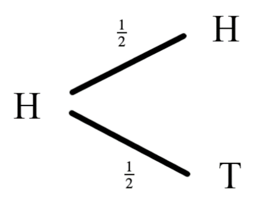
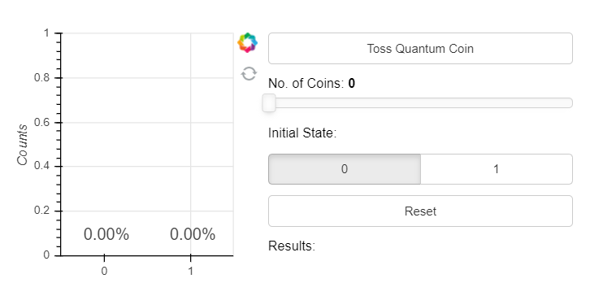
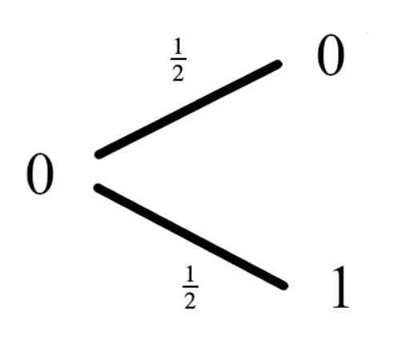
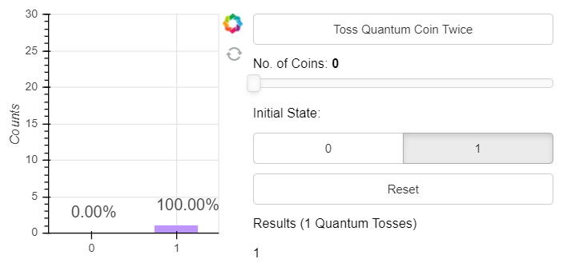
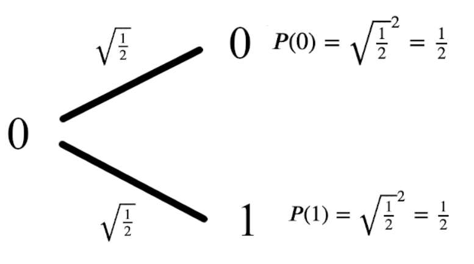

什么是量子？
============

"量子物理学"是一个被广泛使用但却很少被人理解的术语。它是一种数学模型，最初用于描述实验室中微小物体的行为，其揭露了先前"经典"物理学理论的缺陷。量子理论解释了这种行为，并为我们提供了一个更完整的宇宙图像。人们已经意识到可以利用这种以前无法解释的行为来进行某些之前认为不可能的计算。人们将其称之为量子计算。

量子计算是您涉足量子物理学的完美方式。量子计算将量子物理学的核心概念提炼为最简单的形式，同时剥离了物理世界的复杂性。本文将带您去探索和理解一些奇怪的量子现象，并让您对什么是"量子"有一个初步的了解。

经典概率回顾
------------

若要理解量子现象，我们首先需要了解"经典"概率。此处的"经典"是指在量子物理被发现之前，比如您在上学时学到的正态概率树（normal
probability
tree）。如果您对已经熟悉了这些材料，那么请快速浏览一下。如果您对这个不是很感兴趣，也不用担心------我们只会涵盖一些可能是最简单的概率问题。

### 概率树

希望您还记得上学时学过的概率树。该想法很简单------用一张图描绘出每一种可能发生事情的可能性，从中计算出其发生的几率。

假设我们有一枚均匀的硬币，以包含头像（Head）的一面为正面。然后抛掷这一均匀硬币并观察结果，会发看到正面H及反面T的机率各占50%。我们将这一结果画在一个概率树上：

{width="2.4144181977252845in"
height="1.9333333333333333in"}我们在每个分叉的末端画出结果并在每个分叉上标注出现的概率。与上述步骤相同，如果从反面开始抛掷这个硬币，仍各有50%的机会看到正面或反面。

{width="2.8368055555555554in"
height="2.4166666666666665in"}

我们可以通过不断尝试来测试这个过程。您可以找出一枚硬币并抛掷多次，然后记录每一次的结果；最终您会看到大约有50%的结果是正面H，50%是反面T。经验估计大约需要500到1000次抛掷就足以得出可靠的结果。

### 实验\#1：单硬币抛掷

如果您没有时间进行这样的实验？请不必担心！您可以通过点击网页上的"Toss
Coin"按钮来模拟这个实验，并保存抛掷的结果。您还可以改变抛掷时的初始状态为正面（Head）或反面（Tail），或通过增加硬币的数量来快速获取大量结果。点击"Reset"可以丢弃先前的结果并重新开始。

{width="4.918145231846019in"
height="3.6166666666666667in"}

### 进一步探索

通过上面的实验可以验证：概率树模型正确地预测了实验的结果。此时我们可以更进一步，通过把概率树串联起来预测一连串事件的结果。假设我们从正面（Head）开始抛硬币并不断重复，结果会是什么？此时我们可以利用概率树解读：

{width="4.042016622922135in"
height="3.850333552055993in"}

您可能还记得沿着概率树中树枝上的概率相乘来计算一个事件的组合概率：

{width="5.768055555555556in"
height="3.14375in"}

然后将结果相加，计算每种结果的概率：

{width="5.768055555555556in"
height="2.5145833333333334in"}

可以看到在两次抛掷后看到正面H的概率是50%，在两次抛掷后看到反面T的概率也是50%。

### 实验\#2：双硬币抛掷

您可以通过按两次"Toss
Coin"按钮来模拟单硬币抛掷实验并获得最终结果。还可以改变初始状态或改变同时被抛掷的硬币数量来快速获取大量结果。

{width="5.768055555555556in"
height="3.3541666666666665in"}

通过足够多次的抛掷，我们发现结果与预期相同：正面H和反面T的出现次数几乎相同。

量子硬币
--------

通过上面的实验，我们对经典硬币有了完整的了解。现在引入量子"硬币"，称为"量子比特（qubit）"。

因为其很难被操纵，所以量子比特只能在实验室里玩。经过多年的科学和技术的进步已经能够创造出现今我们所拥有的量子比特了，但学习量子计算的美妙之处在于，我们可以忽略物理的复杂性并仅需记住当测量一个量子比特时，其将会处在两种状态之一：量子比特的状态$0$和状态$1$。

### 实验\#3：量子硬币抛掷

现在我们使用量子硬币来做进行抛掷实验。与上面的抛掷经典硬币的实验一样，进行量子抛掷、测量量子硬币的状态并记录。

{width="5.768055555555556in"
height="2.8916666666666666in"}

然后，尝试用概率树来描述这一过程中的量子硬币。在状态$0$下抛掷量子硬币有50%的机率会得到$0$或$1$，我们把这一结果画在概率树上：

{width="2.5479604111986003in"
height="2.2333333333333334in"}

{width="5.768055555555556in"
height="3.120833333333333in"}

想类似的，在状态1下各有50%的机率测得结果为0或1，所绘制的概率树为：

{width="3.174433508311461in"
height="2.783333333333333in"}

### 实验\#4：双量子硬币抛掷

自此我们有了一个可以预测量子硬币行为的模型。现在我们想要对这个模型进行测试，观察其是否对新情况也成立。测试的方法为像前面那样一次抛两枚硬币。与经典硬币模型相同，量子硬币模型预测无论开始时处于哪一状态，都有50%的机会测得0或1：

{width="5.768055555555556in"
height="4.501388888888889in"}

我们可以通过工具抛掷一个量子硬币两次：

{width="4.025in"
height="1.9427187226596676in"}

可以看到结果并非如我们所希望。再看看把初始状态设置为1是会发生什么！

{width="4.933333333333334in"
height="2.3621314523184602in"}

这与我们的预测完全不符！模型失效了！这就是物理学家在20世纪初遇到的相同问题。寻找这一问题答案的过程导致了量子物理学的发展，我们将用这一过程来描述抛掷量子硬币。

量子模型
--------

**简而言之，量子理论是包含负数的概率论。**

这句话是什么意思呢？不可能有负的概率，因为根本没有意义。为了包容这一情况，此处使用了一个称为幅值（amplitude）的量并将其画在树上。由于不可能有负的概率而且所有的概率加起来必须是1，为了避开这一事实，此处使用了一个数学技巧：使用幅值的平方来计算概率。

{width="4.646593394575678in"
height="2.589583333333333in"}

从上图中可以看到，从状态0开始抛掷量子硬币的动作给两种结果分配了相同的幅值。当对这些幅值取平方后就给出了测量0或1的正确概率。如何知道幅值为$\sqrt{\frac{1}{2}}$？因为正是上面的实验值给出了正确答案！

从状态1开始，幅值树就会不同：

{width="5.01246062992126in"
height="2.6166666666666667in"}

在此处结果的幅值中出现第一个负数。当我们平方幅值来计算概率时，这个负号就消失了，测得的概率仍是50%。当我们把这些概率串在一起时会发生一些有趣的事情。

对双量子硬币抛掷的诠释
----------------------

与经典概率相同，我们将会沿着幅值树的分叉来计算每中情况的幅值：

{width="4.6582808398950135in"
height="3.497916666666667in"}

为了计算出每个测量结果的概率，我们把这些幅值相加后平方：

{width="4.666666666666667in"
height="2.8002241907261594in"}

可以看到处于状态1硬币（量子比特）的幅值抵消了其他输出，称之为**干涉效应**。您应该试着自己验证这个模型在初始状态为1时是否可以工作。

什么是量子计算？
----------------

上面的过程是不是很有趣？但有何作用呢？事实证明：这些**干涉效应**可以为我们所用；我们可以将这些操作组合起来，比如通过量子硬币抛掷来构建更高效的算法。这些算法可以利用**干涉效应**使错误的答案迅速抵消，并有很高的概率测得正确答案。这就是量子计算背后的思想。
