# 5. 使用量子回路研究量子硬件
===========================

即将到来
--------

当前正在开发以下主题以补充本教程：

1\. 将Ising模型映射到超导量子计算机上

2\. 状态和过程层析成像

5.1 使用重复校验（Repetition Code）修正量子误差的入门
-----------------------------------------------------

### 简介

量子计算要求我们以比特为单位对信息进行编码。在过去的几十年中开发的大多数量子算法都假定这些量子比特是完美的：它们可以在我们期望的任何状态下进行制备，并且可以完全精确地进行操纵。遵循这些假设的量子比特通常被称为逻辑量子比特（logical
qubit）。

在过去的几十年中，在寻找表现为量子比特的物理系统方面取得了巨大的进步，并且一直在开发质量更高的量子比特。但是，这些缺陷永远无法完全消除。这些量子比特总是非常不精确，以至于不能直接用作逻辑量子比特。因此我们将其称为物理量子比特（physical
qubit）。

在当前的量子计算时代，尽管有缺陷，通过设计自定义算法并使用误差缓解措施，我们仍试图使用物理量子比特。然而对于未来的容错时代，我们必须找到从物理量子比特构建逻辑量子比特的方法。这一过程将通过量子误差校正的过程来完成，其中逻辑量子比特被编码在大量物理量子比特中。通过不断地将物理量子比特通过一个高度纠缠的回路来维持编码。辅助自由度也持续地被测量来检测误差的迹象，并允许由误差带出的影响。实现量子计算所需逻辑量子比特的操作将通过对这一过程进行实质的微小扰动来实施。

由于这一过程所需要的大量资源，在容错量子计算机中执行的大多数操作将用于误差的检测和修正。因此，当我们对容错量子计算的进展进行基准测试时，我们必须跟踪我们的设备执行误差修正的情况。

在本章中，我们将看到一个误差修正的特殊例子：重复校验。虽然不是量子误差修正的真实例子------其使用物理量子比特编码逻辑比特而非量子比特------但可以作为所有量子误差修正校验基本概念的简单指南。我们还将看到其如何在目前的原型设备上运行。

### 重复校验简介

#### 误差修正的基本概念

误差修正的基本思想对于量子信息和经典信息是一样的。这让我们可以从一个非常简单的例子开始：打电话。如果有人问您一个问题的答案是"是"或"不是"，您回答的方式将取决于两个因素：

-   是否正确理解的重要性？

-   与您的连通性如何？

以上两个因素都可以用概率参数化。首先，我们可以使用$P_{a}$表示被误解的最大可接受概率。如果要求您确认对冰淇淋口味的偏爱，并且不介意是香草或巧克力，那么$P_{a}$可能会很高。但如果您被问到一个关乎某人生命的问题，则$P_{a}$会低很多。

对于第二个，我们可以使用$p$表示，即您的答案因连通错误而出现乱码的可能性。让我们想象以下情况：一个乱码的"是"不仅听起来像是胡说八道，而且听起来像是"否"。同样！"否"被转换为"是"。那么$p$就是您完全被误解的概率。

良好的连通或相对不重要的问题将导致$p < P_{a}$。在这种情况下，最好以最直接的方式简单回答：您只需说"是"或"否"。

但是，如果您的连通不畅并且您的答案很重要，我们将得到$p > P_{a}$。在这种情况下，仅"是"或"否"是不够的。被误解的可能性会很高。取而代之的是，我们必须以更复杂的结构对答案进行编码，从而使接收者可以解码我们的意思，尽管可能会破坏消息。最简单的方法（许多人不加思索的方法）：只需将答案重复多次。例如，说"是，是，是"而非"是"，或者说"否，否，否"而非"否"。

如果在这种情况下，接收方听到"是，是，是"，则他们当然会得出结论，即发送方的回答是"是"。如果他们听到"否，是，是"，"是，否，是"或"是，是，否"，他们可能会得出相同的结论，因为答案中的肯定大于否定。为了在这种情况下被误解，答复中至少有两个错乱，$P$的概率将小于$p$。因此当以这种方式编码时，信息就更容易被理解。下面的代码显示了这一的一个示例。

> p1 = 0.01
>
> p3 = 3 \* p1\*\*2 \* (1-p1) + p1\*\*3 \# probability of 2 or 3 errors
>
> print(\'Probability of a single reply being garbled: {}\'.format(p1))
>
> print(\'Probability of a the majority of three replies being garbled:
> {:.4f}\'.format(p3))

如果$P < P_{a}$，这一技术就解决了我们的问题。若$P > P_{a}$，则我们只需简单地添加更多重复。上述$P < p$来自一下事实：我们至少需要弄乱两个答复才能使总体错乱。因而，即使是最有可能的情况，其概率也约为$p^{2}$。对于五次重复的情况，我们至少需要弄乱三个答复才能使总体错乱，这一情况发生的概率约为$p^{3}$。在这一情况下，$P$的值将更低。随着我们增加重复次数，$P$将成倍下降。无论连通多么糟糕或我们需要确定如何正确地传递消息，我们都可以通过重复回答足够的次数来实现。

尽管这是一个简单的示例，但其包含误差修正的全部概念。

-   有一些信息要发送或存储：在这种情况下的回答为"是"或"否"。

-   在较大的系统中对信息进行编码，防止受到噪声的干扰：在这种情况下可以通过重复消息实现。

-   最终对信息进行解码来减轻噪声的影响：在这种情况下通过确认所传输信息中的大多数来实现。

通过将0和1分别替换"是"和"否"，也可以将这种相同的编码方案用于二进制。因此，通过使用态$|0\rangle$和$|1\rangle$，也可以轻松地将其推广至量子比特。在大多数情况下，其被称为重复校验（*repetition
code*）。在经典计算和量子计算中也存在许多其他形式的编码，在许多方面都优于重复校验。但是，重复校验作为最简单编码的情况的确使其更加适用于某些应用。一个恰当的情况就是重复校验在Qiskit中的用途：作为量子误差修正思想的第一个也是最简单的实现。

#### 在量子比特上修正误差

现在，我们将使用Qiskit显式地实现这些想法。若要查看不完美量子比特所带来地影响，只需使用原型设备的量子比特即可，还可以在模拟中重现这些效果。为此在下面的函数中创建了一个简单的噪声模型。这些概念超出了前面所讨论的简单事件，即单个噪声事件的发生概率为$p$。与之相反，我们考虑可能发生的两种误差形式。量子门误差：所执行任何操作中的误差。我们在这里使用所谓的去极化噪声以简单的方式对此进行建模。这样做的效果使得概率$p_{\text{gate} }$以完全的随机态替换任一量子比特的状态。对于含有两个量子比特的量子门将会单独应用于每一个量子比特。噪声的另一种来源是测量。在用概率$p_{\text{meas} }$进行测量之前，仅是在0和1之间的即刻翻转，反之亦然。

> from qiskit.providers.aer.noise import NoiseModel
>
> from qiskit.providers.aer.noise.errors import pauli_error,
> depolarizing_error
>
> def get_noise(p_meas,p_gate):
>
> error_meas = pauli_error(\[(\'X\',p_meas), (\'I\', 1 - p_meas)\])
>
> error_gate1 = depolarizing_error(p_gate, 1)
>
> error_gate2 = error_gate1.tensor(error_gate1)
>
> noise_model = NoiseModel()
>
> noise_model.add_all_qubit_quantum_error(error_meas, \"measure\") \#
> measurement error is applied to measurements
>
> noise_model.add_all_qubit_quantum_error(error_gate1, \[\"x\"\]) \#
> single qubit gate error is applied to x gates
>
> noise_model.add_all_qubit_quantum_error(error_gate2, \[\"cx\"\]) \#
> two qubit gate error is applied to cx gates
>
> return noise_model

现在，我们将针对每种误差类型创建一个概率为1％的噪声模型。

noise_model = get_noise(0.01,0.01)

在尝试使用态$|0\rangle$中的三量子比特来存储0时是什么效果？我们将重复这一过程shots=1024次，来查看不同结果的可能性。

> from qiskit import QuantumCircuit, execute, Aer
>
> qc0 = QuantumCircuit(3,3,name=\'0\') \# initialize circuit with three
> qubits in the 0 state
>
> qc0.measure(qc0.qregs\[0\],qc0.cregs\[0\]) \# measure the qubits
>
> \# run the circuit with th noise model and extract the counts
>
> counts = execute( qc0,
> Aer.get_backend(\'qasm_simulator\'),noise_model=noise_model).result().get_counts()
>
> print(counts)
>
> 输出：
>
> {\'001\': 14, \'010\': 7, \'000\': 989, \'101\': 1, \'100\': 13}

在此处，我们看到几乎所有结果仍是\'000\'，就好像噪音不存在一样。在其余的可能中，大部分为0的可能性最大。总共少于100个样本的大部分为1。在使用此回路编码0时$P < 1\%$。

现在尝试使用态为$|1\rangle$的三量子比特来存储1的方法。

> qc1 = QuantumCircuit(3,3,name=\'0\') \# initialize circuit with three
> qubits in the 0 state
>
> qc1.x(qc1.qregs\[0\]) \# flip each 0 to 1
>
> qc1.measure(qc1.qregs\[0\],qc1.cregs\[0\]) \# measure the qubits
>
> \# run the circuit with th noise model and extract the counts
>
> counts = execute( qc1,
> Aer.get_backend(\'qasm_simulator\'),noise_model=noise_model).result().get_counts()
>
> print(counts)
>
> 输出：
>
> {\'011\': 12, \'111\': 983, \'110\': 13, \'101\': 16}

大部分错误状态的样本数量再次远远少于100，因此$P < 1\%$。无论我们存储0还是1，我们都能在任何噪声源下以更小的误差概率检索信息。

上述过程存在可操作性，因为我们加入的噪声相对较弱。当我们增加$p_{\text{gate} }$和$p_{\text{meas} }$时，概率$P$也会增大。在这一状态下存在一种极端情况：$p_{\text{gate} }$和$p_{\text{meas} }$都以50/50的机会产生量子比特的反转误差x。例如，设置$p_{\text{gate} } = 0$以及$p_{\text{meas} } = 0.5$后重新运行该量子回路。

> noise_model = get_noise(0.5,0.0)
>
> counts = execute( qc1,
> Aer.get_backend(\'qasm_simulator\'),noise_model=noise_model).result().get_counts()
>
> print(counts)
>
> 输出：
>
> {\'111\': 133, \'001\': 121, \'010\': 118, \'011\': 105, \'110\': 150,
> \'000\': 126, \'101\': 138, \'100\': 133}

通过这些噪声，所有输出都以相同的概率出现，结果的差异仅由统计噪声引起。被编码状态不存在任何痕迹。这是思考误差修正的重要观点：有时噪音太强烈而导致无法修正。最佳的方案是将编码所需信息的好方法与噪声不太强的硬件结合起来。

#### 存储量子比特

到目前为止，我们已经考虑了编码和解码之间没有延迟的情况。对于量子比特，这意味着在初始化回路和进行最终测量之间不会存在大段时间的间隔。

然而，在多数情况下会存在很大的延迟。一个显而亦然的例子：人们可能希望编码一个量子状态并将其存储很长时间，就如同一个量子硬盘驱动器一样。一个不太明显但更重要的例子是执行容错量子计算本身。为此，我们需要存储量子态并在计算过程中保持其的完整性。这一操作还必须以某种方式来完成，即允许我们以需要的任何方式来操作存储的信息，并修正在执行操作时可能引入的任何误差。

在所有可能的情况下我们都需要考虑一个事实，即：误差不仅发生在某些事情发生时(如生成量子门或测量)，也发生在量子比特空闲时。这种噪声的生成是由于量子比特与其他量子比特及其环境相互作用而产生。量子比特闲置的时间越长，这种噪声的影响就越大。如果将放置量子比特足够长的时间，我们将会遇到类似上述$p_{\text{meas} } = 0.5$的情况，在这一情况下由于噪声太强烈以至于错误无法可靠地得到修正。

这一问题的解决方法是在整个过程中进行持续测量，保证没有量子比特会被长时间闲置。从而取代不断从系统中提取信息来跟踪已发生的误差。

对于经典信息，比如我们只想存储$0$或$1$，可以通过不断地测量每个量子比特的值来完成。通过跟踪何时值由于噪声而变化，我们可以轻松推断出何时发生误差的历史记录。

但是，对于量子信息来说就没有那么容易了。例如，考虑希望对逻辑状态$| + \rangle$进行编码的情况：

$$\left| 0 \right\rangle \rightarrow \left| 000 \right\rangle,|1\rangle \rightarrow |111\rangle$$

使用下式编码逻辑态$| + \rangle$：

$$| + \rangle = \frac{1}{\sqrt{2} }(|0\rangle + |1\rangle) \rightarrow \frac{1}{\sqrt{2} }(|000\rangle + |111\rangle)$$

通过所使用的重复校验，逻辑量子比特的z测量（用于区分态$|0\rangle$和态$|1\rangle$）是使用每个物理量子比特的z测量来完成的。逻辑测量的最终结果从物理量子比特测量结果中解码得出，只需看哪中输出占多数。

如前所述，我们可以通过对物理量子比特进行z测量来跟踪存储了很长时间的逻辑量子比特上的误差。然而，请注意这一有效地对应于持续执行物理量子比特的z测量。如果我们只是简单地存储0或1，这一方法是可行的，但如果所存储的是叠加态，就会产生不希望看到的效果。具体来说：第一次检查误差时就会坍缩叠加态。

这就不那么理想了。如果我们想在逻辑量子比特上做一些计算，或想在最终测量之前做一个基变换，我们就需要保持量子比特的叠加态，那么将其破坏就是一个误差。但这并不是由设备的缺陷造成的误差，而是试图修正错误时引入的误差。由于我们不能指望在量子计算机中重现任意的叠加态，这就变成一个无法修正的误差。

基于此缘由，我们必须找到另一种方法来跟踪逻辑量子比特长时间存储时发生的误差。这就为我们给出了检测和修正误差和以高概率解码最终测量结果所需的信息。因而在这一过程中，由于我们保持叠加态坍缩，就不会导致不可修正的误差发生。

使用以下回路元素可以实现此目的。

> from qiskit import QuantumRegister, ClassicalRegister
>
> %config InlineBackend.figure_format = \'svg\' \# Makes the images look
> nice
>
> cq = QuantumRegister(2,\'code\\ qubit\\ \')
>
> lq = QuantumRegister(1,\'ancilla\\ qubit\\ \')
>
> sb = ClassicalRegister(1,\'syndrome\\ bit\\ \')
>
> qc = QuantumCircuit(cq,lq,sb)
>
> qc.cx(cq\[0\],lq\[0\])
>
> qc.cx(cq\[1\],lq\[0\])
>
> qc.measure(lq,sb)
>
> qc.draw()
>
> 输出：

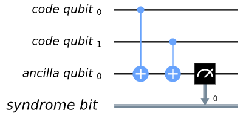

此处我们使用了三个物理量子比特。其中两个被称为"编码量子比特（code
qubit）"，另一个被称为"辅助量子比特（ancilla
qubit）"。提取输出的比特称为校验比特（syndrome
bit）。辅助量子比特总是初始化为态$|0\rangle$。然而，可以在不同的状态下初始化编码量子比特。为了查看不同的输入对输出有何影响，我们可以创建一个回路qc_init，其在某种状态下准备编码量子比特，然后运行回路qc_init+qc。

首先,简单的例子：qc_init不做任何设置,所以编码量子比特初始化为$|00\rangle$。

> qc_init = QuantumCircuit(cq)
>
> (qc_init+qc).draw()
>
> 输出：

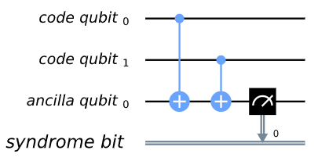

> counts = execute( qc_init+qc,
> Aer.get_backend(\'qasm_simulator\')).result().get_counts()
>
> print(\'Results:\',counts)
>
> 输出：
>
> Results: {\'0\': 1024}

可以看到输出全为0。

现在尝试初始态为$|11\rangle$。

> qc_init = QuantumCircuit(cq)
>
> qc_init.x(cq)
>
> (qc_init+qc).draw()
>
> 输出：

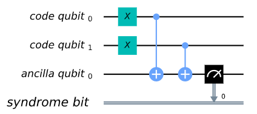

> counts = execute( qc_init+qc,
> Aer.get_backend(\'qasm_simulator\')).result().get_counts()
>
> print(\'Results:\',counts)
>
> 输出：
>
> Results: {\'0\': 1024}

此时的输出仍全为0。由于量子力学的线性度,对于任一叠加态$|00\rangle$和$|11\rangle$，我们也可以认为这是真的情况，比如下面的例子。

> qc_init = QuantumCircuit(cq)
>
> qc_init.h(cq\[0\])
>
> qc_init.cx(cq\[0\],cq\[1\])
>
> (qc_init+qc).draw()
>
> 输出：

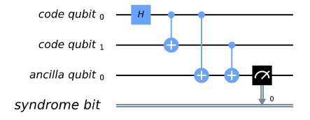

> counts = execute( qc_init+qc,
> Aer.get_backend(\'qasm_simulator\')).result().get_counts()
>
> print(\'Results:\',counts)
>
> 输出：
>
> Results: {\'0\': 1024}

相反的结果将出现在的初始态为$|01\rangle$，$|10\rangle$或任意其他叠加态时。

> qc_init = QuantumCircuit(cq)
>
> qc_init.h(cq\[0\])
>
> qc_init.cx(cq\[0\],cq\[1\])
>
> qc_init.x(cq\[0\])
>
> (qc_init+qc).draw()
>
> 输出：

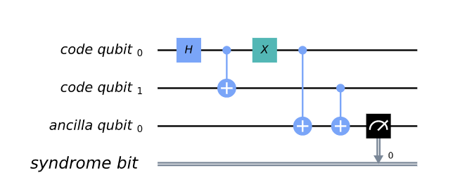

> counts = execute( qc_init+qc,
> Aer.get_backend(\'qasm_simulator\')).result().get_counts()
>
> print(\'Results:\',counts)
>
> 输出：
>
> Results: {\'1\': 1024}

在这一情况下，输出都为"1"。

因此，这一测量告诉我们多个量子比特的集体性质。具体来说，该测量查看两个编码量子比特，并确定它们的状态与z-基相同还是不同。对于与z-基相同的基态，如$|00\rangle$和$|11\rangle$，测量仅返回0。对于任意叠加态都是这样处理。由于这一测量不会以任何方式区分这些状态，因此也不会导致叠加态的坍缩。

类似地，相对z-基不同的基态，该测量返回1。这对于$|01\rangle$，$|10\rangle$或其任意其他叠加态都一样。

现在，假设我们对重复校验中的所有物理比特对都应用这样的"校验测量（syndrome
measurement）"。如果状态重复为$|0\rangle$、$|1\rangle$或其他任意叠加态，则所有校验测量都将返回0。通过给出此结果，我们将知道状态确实以所希望的重复状态编码，并可以推断出没有误差发生。但如果某些校验测量结果返回1，则表示错误。因此，我们可以使用这些测量结果来确定如何解码出结果。

#### 量子重复校验

现在，我们已经明确了重复校验量子版本的实现方式了。通过从Ignis导入所需的工具，就可以在Qiskit中使用重复校验。

> from qiskit.ignis.verification.topological_codes import RepetitionCode
>
> from qiskit.ignis.verification.topological_codes import
> lookuptable_decoding
>
> from qiskit.ignis.verification.topological_codes import GraphDecoder

在此处，我们可以自由选择要将逻辑量子比特编码到多少个物理量子比特上。我们还可以选择在最终读出测量结果之前存储逻辑量子比特的同时应用校验测量的次数。我们从最小的非平凡情况入手：三个重复和一个校验测量。然后使用Qiskit-Ignis中的RepetitionCode对象自动创建重复校验的回路。

这样，我们就可以检查code的各种属性，例如用于code中的量子比特寄存器名称和辅助量子比特。

> n = 3
>
> T = 1
>
> code = RepetitionCode(n,T)

RepetitionCode包含两个实现code的量子回路：两个可能逻辑比特值中的每个逻辑比特，分别是逻辑0和1。

> \# this bit is just needed to make the labels look nice
>
> for reg in code.circuit\[\'0\'\].qregs+code.circuit\[\'1\'\].cregs:
>
> reg.name = reg.name.replace(\'\_\',\'\\ \') + \'\\ \'
>
> code.circuit\[\'0\'\].draw()
>
> 输出：

> code.circuit\[\'1\'\].draw()
>
> 输出：

在这些量子回路中有两种类型的物理量子比特。在"编码量子比特"中逻辑状态被编码在三个物理量子比特上。"连接量子比特"用作校验测量的辅助量子比特。

在这些回路中，单轮校验测量仅包含两个校验测量。一个比较编码量子比特0和1，另一个用于比较量子比特1和2。我们也许想要进行进一步的测量，通过比较编码量子比特0和2来创建一个完整的集合。但是，有这两个校验测量就足够了。这是因为量子比特0和2是否相同的信息可以从量子比特0和1以及量子比特1和2是否与z-基相同推导出。对于第个𝑛量子比特，我们可以从邻近量子比特对的𝑛−1校验测量中获得所需的信息。

在没有任何噪音的模拟器上运行这些回路会得到非常简单的结果。

> def get_raw_results(code,noise_model=None):
>
> circuits = code.get_circuit_list()
>
> raw_results = {}
>
> for log in range(2):
>
> job = execute( circuits\[log\], Aer.get_backend(\'qasm_simulator\'),
> noise_model=noise_model)
>
> raw_results\[str(log)\] = job.result().get_counts(str(log))
>
> return raw_results
>
> raw_results = get_raw_results(code)
>
> for log in raw_results:
>
> print(\'Logical\',log,\':\',raw_results\[log\],\'\\n\')
>
> 输出：
>
> Logical 0 : {\'000 00\': 1024}
>
> Logical 1 : {\'111 00\': 1024}

我们可以看到输出分为两部分。右边的部分是两个校验测量的结果。左边的是编码量子比特的三次最终测量结果。

对于更多的测量次数$T = 4$的情况，就会在输出的右边显示出更多的边校验测量的结果。

> code = RepetitionCode(n,4)
>
> raw_results = get_raw_results(code)
>
> for log in raw_results:
>
> print(\'Logical\',log,\':\',raw_results\[log\],\'\\n\')
>
> 输出：
>
> Logical 0 : {\'000 00 00 00 00\': 1024}
>
> Logical 1 : {\'111 00 00 00 00\': 1024}

对于更多重复，如$n = 5$的情况，每一测量组（包含两个校验测量）会变的更大。在左侧的最终测量会变为$n$个量子比特。第$T$次校验测量将作用于每一个$n - 1$的可能邻近量子比特对上。

> code = RepetitionCode(5,4)
>
> raw_results = get_raw_results(code)
>
> for log in raw_results:
>
> print(\'Logical\',log,\':\',raw_results\[log\],\'\\n\')
>
> 输出：
>
> Logical 0 : {\'00000 0000 0000 0000 0000\': 1024}
>
> Logical 1 : {\'11111 0000 0000 0000 0000\': 1024}

### 查找表解码（Lookup table decoding）

现在让我们回到$n = 3$以及$T = 1$的示例上，并在其中加入一些噪声。

> code = RepetitionCode(3,1)
>
> noise_model = get_noise(0.05,0.05)
>
> raw_results = get_raw_results(code,noise_model)
>
> for log in raw_results:
>
> print(\'Logical\',log,\':\',raw_results\[log\],\'\\n\')
>
> 输出：
>
> Logical 0 : {\'100 11\': 1, \'011 10\': 1, \'001 01\': 7, \'100 00\':
> 55, \'101 01\': 1, \'010 11\': 3, \'101 00\': 5, \'110 00\': 4, \'110
> 01\': 2, \'000 10\': 77, \'000 11\': 12, \'001 00\': 46, \'001 10\':
> 2, \'100 01\': 4, \'100 10\': 4, \'111 00\': 1, \'000 00\': 641, \'010
> 00\': 47, \'010 10\': 5, \'011 00\': 4, \'000 01\': 78, \'011 01\': 1,
> \'001 11\': 1, \'010 01\': 22}
>
> Logical 1 : {\'101 10\': 5, \'100 11\': 1, \'111 10\': 73, \'011 10\':
> 22, \'011 11\': 2, \'001 01\': 2, \'101 11\': 18, \'100 00\': 5, \'101
> 01\': 19, \'101 00\': 56, \'110 00\': 52, \'110 10\': 7, \'110 01\':
> 23, \'111 11\': 13, \'001 00\': 6, \'001 10\': 1, \'100 01\': 3, \'111
> 00\': 586, \'110 11\': 1, \'010 00\': 6, \'010 10\': 2, \'011 00\':
> 54, \'011 01\': 5, \'111 01\': 59, \'001 11\': 1, \'010 01\': 2}

此处我们创建了名为raw_results的Python字典，用于存储编码逻辑0和逻辑1回路的输出。

当面对任何可能的输出时，我们的任务是确定如果没有噪声则结果应该如何。对于输出为"000
00"或"111
11"的情况，答案显而易见。在没有错误发生时，都是刚才所见逻辑0和逻辑1的输出。前者是逻辑0最常见的输出，而后者是逻辑1最常见的输出。因此，我们可以得出这样的一个结论：对于逻辑0，当遇到"000
00"时，输出就是如此；对于逻辑1，当遇到"111 00"时，输出亦为如此。

尽管这是最佳策略，但也可能失效。可以看到：对于编码0，"111
00"通常会在少数情况下出现；对于编码1，也会有类似情况。在本示例中，虽然输出没有错误发生，我们也会不正确的多输出进行解码。在这样的情况下，大量的错误串联起来，使其看起来就像我们有一个相反逻辑值的无噪声情况，因此校正就无法实现。

我们可以使用类似的策略来解码所有其他输出。比如输出"111
00"，在逻辑0中出现的次数比在逻辑1中出现的次数多。这是因为在前一种情况下，它可能仅由单个测量错误（将单个0错误地报告为1）引起，但在后一种情况下，需要至少两个错误。所以每当我们看到"001
00"，我们可以将其解码为逻辑0。

对所有字串应用这种策略就是所谓的"查找表解码"。这是分析每个可能输出的地方，用于确定最可能解码的值。对于大量的量子比特来说，查找表就无法处理了，因为可能输出的数量会变得非常巨大。在这种情况下会需要更多的算法解码器。但是，查找表解码在测试小代码时效果很好。

我们可以在任意代码中使用Qiskit中的工具来实现查找表解码。为此，我们需要两组输出。其中的一个是想要解码的输出集合，为此需要计算错误解码的概率$P$。此处，我们将使用已创建的raw_results。

另一组输出则被用作查找表。这将需要运行大量样本来确保其能够获得每个可能输出的良好统计数据。我们设置运行次数shots=10000。

> circuits = code.get_circuit_list()
>
> table_results = {}
>
> for log in range(2):
>
> job = execute( circuits\[log\], Aer.get_backend(\'qasm_simulator\'),
> noise_model=noise_model, shots=10000 )
>
> table_results\[str(log)\] = job.result().get_counts(str(log))

对这个称为table_results的数据，我们现在可以使用Qiskit中的lookuptable_decoding函数。这一函数从raw_results中获取输出，并使用table_results中的信息对其进行解码。然后检查如果解码正确则使用这些信息来计算$P$。

> P = lookuptable_decoding(raw_results,table_results)
>
> print(\'P =\',P)
>
> 输出：
>
> P = {\'0\': 0.0247, \'1\': 0.0217}

此处的$P$值远低于$p_{\text{meas} }$和$p_{\text{gate} }$，因此我们在存储比特值的可靠性方面得到了改进。还要注意编码1的$P$值都高于0。这是因为编码1需要应用x门------这回引入额外的噪声源。

### 图论译码（Graph theoretic decoding）

上节中所考虑的解码方式能够生成最有可能的结果且无须任何编码细节。然而，其一个主要缺点抵消了所有这些优点：查找表会随着编码大小的增加呈现指数增长。由于这一原因且考虑到编码的结构以及所生成的校验，解码通常以一种更加算法的方式进行。

topological_codes中的代码通过对校验子（syndrome）的后处理（post-processing）揭示了这一结构。我们没有使用上节中所示的形式，而使用编码对象的process_results方法将且重写为另一种形式，左侧是编码量子比特的最终测量结果，右侧是伴随测量处的输出。

例如，下面是raw_results字典经过处理的形式，此处$n = 3$、$T = 2$。为清楚起见，仅显示50或更多样本的结果。

> code = RepetitionCode(3,2)
>
> raw_results = get_raw_results(code,noise_model)
>
> results = code.process_results( raw_results )
>
> for log in \[\'0\',\'1\'\]:
>
> print(\'\\nLogical \' + log + \':\')
>
> print(\'raw results \', {string:raw_results\[log\]\[string\] for
> string in raw_results\[log\] if raw_results\[log\]\[string\]\>=50 })
>
> print(\'processed results \', {string:results\[log\]\[string\] for
> string in results\[log\] if results\[log\]\[string\]\>=50
> })measurement
>
> 输出：
>
> Logical 0:
>
> raw results {\'000 00 00\': 495, \'000 10 00\': 53}
>
> processed results {\'0 0 00 00 00\': 495, \'0 0 00 10 10\': 53}
>
> Logical 1:
>
> raw results {\'111 00 00\': 429, \'111 00 10\': 52, \'111 01 00\': 61,
> \'111 10 00\': 51}
>
> processed results {\'1 1 00 00 00\': 429, \'1 1 10 10 00\': 52, \'1 1
> 00 01 01\': 61, \'1 1 00 10 10\': 51}

在上面的输出中我们可以看到"000 00 00"被转换为"0 0 00 00 00"，"111 00
00"被转换为"1 1 00 00 00"等等。

在这些新的字串中，逻辑0中最左侧的"0 0"和逻辑1最左侧的"1
1"都为逻辑读出（logical
readout）。由于编码量子比特都相同（没有错误），任一编码量子比特都可用于这一读出。因此在这一位置仅有单个0或单个1在原则上可能。我们也可以对结果原始形式中每个量子都进行这样的运算并获得$n$。从而取代我们所使用的字串尾部的两个量子比特。其原因将在后文中说明。在没有错误的情况下，这两个值将总是相等，因为它们表示相同的编码比特值。

在逻辑值跟随第一轮校验测量的$n - 1$个结果之后。0表示对应的*量子比特对*具有相同的值，而1表示量子比特之间彼此不同。由于第$d$个编码量子比特的行具有$n - 1$个可能的相邻对，因此有$n - 1$个结果。在没有错误的情况下，其都将为0。这与原始结果形式的第一个此类校验结果完全相同。

下个块是下一轮校验结果。但是，与其直接呈现这些结果，不如说它使我们在第一轮和第二轮之间出现了校验子变化。因此，其是第二轮与第一轮的校验测量结果的*逐位或*（bitwise
OR） 在没有错误的情况下都将为0。

所有后续块都遵循相同的方式，尽管最后一个需要进行注释。这不是对连接量子比特的标准测量方式。相反，其是根据所有编码量子比特的最终读出测量得出的结果。再次强调，此处将其表示为校验子更改，在没有错误的情况下将全为0。这是第$T + 1$个块的校验测量，因为由于它的处理方式与其他方法不同，因此不在第$T$个校验测量回合中进行计数。

以下示例进一步说明此约定。

**示例1**：0 0 0110 0000
0000表示$d = 5$，$T = 2$对0进行编码的重复校验。该校验子很可能表明在第一次测量回合之前，中间的编码量子比特因误差而翻转。这就导致其与回路中其余部分的两个相邻编码量子比特不同。这在第一轮校验中显示出来，但是在后续的块中不对其进行报告，由于其不再代表更改。其他类型的错误也可能导致这种校验子，但是由于它们更复杂，因此可能性更低。

**示例2**：0 0 0010 0010
0000表示$d = 5$，$T = 2$对0进行编码的重复校验。此处，其中的一个校验测量结果报告了第一轮中两个编码量子比特之间的差异，其为1。在下一轮中未看到相同的效果，因此结果为0。但是，由于与之前的校验测量结果不同，且由于我们跟踪校验子的变化，因此该变化会导致另一个1。在随后的回合也不会检测到任何变化，但这不再表示变化，因此在相同位置产生0。第一个1的测量结果很可能是由错误引起的。

**示例3**：0 1 0000 0001
0000表示$d = 5$，$T = 2$对1进行编码的重复校验。在第二轮校验测量之前，翻转行尾的编码量子比特。由于其在行的末尾，因此只能通过一次校验测量检测出来。出于相同的原因，其也干扰了逻辑读出之一。

我们可以注意到在上面的三个示例中单个误差实际上导致了字串中不应该发生误差的两个字符改变。这在topological_codes中用于表示稳定子（stabilizer）的特性，通常用于定义在其上定义解码问题的图。

具体来说，该图是通过首先将回路编码为逻辑0构造，对于该图输出字串中的所有比特值都应为0。然后将其复制后在模拟器上创建并运行，并在每个模拟器中插入不同的Pauli算子。在每一个量子比特和回路深度上，对三种Pauli算子中的每一种都进行了这样的运算。这些回路中每个回路的输出都可用于确定每一个可能单个误差的影响。由于回路仅包含Clifford运算，因此可以有效地执行仿真。

每一次误差都会准确地改变两个字符，除非没有产生影响。然后构造一个图，其输出字串的每一比特对应一个节点，受同一误差影响的比特对对应一条边。

根据输出字串中发现的校验子，解码特定输出字串的过程通常需要算法推断出由哪一组引起了错误。这个过程可以通过构造第二个图来实现，该图只包含与输出中的非平凡校验比特相对应的节点。然后在每对节点之间放置一条边，相应的权值等于原始图中这些节点之间最小路径的长度。然后通过与该校验子一致的一组误差对应地找出该与之完美匹配的图。若要推断出最可能发生误差的组，一个较好的策略是找出一个误差最少且与所观察到的校验子相一致的组。这与所对应于图中的最小权值完美匹配。

使用最小权重完美匹配是重复校验和表层编码（surface
code）的标准解码技术，其已在Qiskit
Ignis中实现。当然还可用于其他情况，例如颜色编码（color
code）。但对于每一个编码和噪声模型都无法找到最可能发生误差组的最佳近似值。因此，可以使用基于相同图的其他解码技术。Qiskit
Ignis的GraphDecoder可用于计算给定编码的图并且给出了多种分析方法。在撰写本文时，仅实现了最小权重完美匹配。

请注意！对于诸如表层编码之类的代码，严格意义上说每个误差只会改变输出字串中两个比特的值。例如一个$\sigma^{y}$错误将会翻转两个不同类型稳定子所对应的一对值，通常为独立解码。因此这些编码的输出将以此方式呈现，对这些校验子的分析将相应地创建多个独立的图来表示不同的校验类型。

### 运行重复校验基准测试

在本小结中我们将在真实的量子设备上运行重复校验，并使用该输出作为基准。首先，我们将会简要地概述这一过程。这一过程适用于即将展示的重复校验的示例，同时也适用于topological_codes中的其他基准测试，通常也适用于Qiskit
Ignis。一般情况下，基准测试过程由以下三步组成。

1\. 定义任务。用Qiskit Ignis定义并创建一组将会运行的回路。

2\. 运行回路。通常由Qiskit完成，然则任何伺服和实验设备都可接入。

3\. 由Qiskit Ignis处理回路的结果，以便生成给定任务所需的输出。

对于topological_codes，步骤1要求选择量子误差修正编码的类型和大小。其中，每种类型的编码都有一个专用的Python类。通过给出所需的参数来初始化对应的对象，例如RepetitionCode对象的n和T。然后，生成的对象包含回路对应给定代码所编码的简单逻辑量子态（$|0\rangle$，$|1\rangle$），并在最后读出一个明确逻辑基矢（通常是标准$|0\rangle/|1\rangle$测量）之前，运行程序中所指定次数的错误检测。

对于topological_codes，步骤3的主要过程是解码，其目的是利用从误差检测中获得的信息来减少最终读出中的任何错误。解码的最佳算法通常因编码而异，然则结构类似的编码通常使用相似的方法。

topological_codes的目的是给出各种解码方法，依此实现的所有类似解码器都可用于编码。其中的过程通过限制解码的代码来实现，可被描述为一个图论的最小化问题。这种编码方式的典型例子是环曲面编码（toric
code）和表层编码。2D颜色编码和匹配编码也具有这一性质。所有这些编码类型都是所谓拓扑量子误差修正编码的突出示例，从而导出了子程序包的名称。但请注意！并非所有拓扑编码都与此解码器兼容，而某些非拓扑编码与之兼容，如重复校验。

解码过程由GraphDecoder类完成。通过给出将为其执行解码的已编码对象来初始化相应的GraphDecoder对象，接着以之确定将被用于定义解码问题的图。然后就可以使用解码器对象的各种方法对结果进行处理。

在下文中，我们将会看到将上述思想用于重复校验的实际过程。在此过程中，我们将使用两个布尔变量step_2和step_3。变量step_2用于显示从设备获取数据时所需运行程序的部分，变量step_3用于显示处理结果数据的部分。

默认情况下，两个变量都设置为false，以便确保仅使用先前收集和处理的数据即可运行以下所有程序的片段。但若要获取新数据时只需step_2
= True，而对任何数据执行解码时仅需step_3 = True。

> step_2 = False
>
> step_3 = False

若要对一台真实量子设备进行基准测试，需要有通过网络访问该设备所需的工具，并编译适合在其上运行的回路。

> from qiskit import IBMQ
>
> from qiskit.compiler import transpile
>
> from qiskit.transpiler import PassManager

现在我们可以创建用于运行量子回路的后端对象，这一过程是通过给出用于指定设备的字串实现。这里使用了\'ibmq_16_melbourne\'，它在写入时有15个激活的量子比特。我们还将考虑位于罗切斯特（Rochester）大学含有53量子比特的量子设备，其由'ibmq_rochester'指定。

> device_name = \'ibmq_16_melbourne\'
>
> if step_2:
>
> IBMQ.load_account()
>
> for provider in IBMQ.providers():
>
> for potential_backend in provider.backends():
>
> if potential_backend.name()==device_name:
>
> backend = potential_backend
>
> coupling_map = backend.configuration().coupling_map

当在真实的量子设备上运行回路时，首先需要实现一个转译（transpilation）过程。这一过程会将回路中的量子门转换为由真实设备所实现的原生量子门集。在某些情况下这些转换不会引起较大的改变，例如用相应的欧拉角度将每个Hadamard门表示为单个量子比特的旋转。然而，如果回路不遵守真实设备的连接性，则变化可能会很大，如回路中的受控非门无法由真实设备直接实现。然后，必须通过例如使用额外的受控非门在周围移动量子比特状态等技术在真实的设备中重现回路。除了引入额外的噪声外，还会使已经存在的噪声扩大。原始回路中单一量子比特的误差在附加转译的作用下会影响到多个量子比特。因此在运行量子误差校正回路时，必须防止这种非平凡的转译。

测试重复校验要求量子比特有效地沿一条线排列，其中唯一的受控非门要求相邻于这一条线。因此，首要任务是研究真实设备的耦合映射并找出一条线。

对于在IBM墨尔本的量子设备，有可能找到一条涵盖所有15个量子比特的线。在下面的列表行中被设计为避免最容易出错受控非门。对于罗切斯特大学含有53量子比特的量子设备，没有一条线能够覆盖全部53个量子比特。我们可以使用下面的方法来覆盖其中的43个量子比特。

> if device_name==\'ibmq_16_melbourne\':
>
> line = \[13,14,0,1,2,12,11,3,4,10,9,5,6,8,7\]
>
> elif device_name==\'ibmq_rochester\':
>
> line =
> \[10,11,17,23,22,21,20,19,16,7,8,9,5\]\#,0,1,2,3,4,6,13,14,15,18,27,26,25,29,36,37,38,41,50,49,48,47,46,45,44,43,42,39,30,31\]

至此我们明确了有多少个量子比特可用于构建所需运行的重复校验编码。可以看出具有n位重复校验的编码会用到n个编码量子比特以及n-1个链接量子比特，故全部需要2n-1个量子比特。

> n_min = 3
>
> n_max = int((len(line)+1)/2)
>
> code = {}
>
> for n in range(n_min,n_max+1):
>
> code\[n\] = RepetitionCode(n,1)

在运行这些代码所构建的量子回路之前，需要确认转译器知道设备上哪些物理量子比特将会被使用。这意味着位于line\[0\]的量子比特为第一个编码量子比，位于line\[1\]的量子比特为第一个链接量子比特，依此类推。这一设定通过以下函数完成，该函数接收重复校验对象（code）和line作为参数，并创建一个Python字典来指定code中的量子比特所对应的line元素。

> def get_initial_layout(code,line):
>
> initial_layout = {}
>
> for j in range(n):
>
> initial_layout\[code.code_qubit\[j\]\] = line\[2\*j\]
>
> for j in range(n-1):
>
> initial_layout\[code.link_qubit\[j\]\] = line\[2\*j+1\]
>
> return initial_layout

现在，我们就可以通过对这些回路进行转译来创建在真实设备上运行的量子回路。同时通过检查确保转译过程确实没有引入非平凡效应而增加量子比特的数量。此外，已编译回路被收集至单个列表中，以便允许其在同批作业中被同时提交。

> if step_2:
>
> circuits = \[\]
>
> for n in range(n_min,n_max+1):
>
> initial_layout = get_initial_layout(code\[n\],line)
>
> for log in \[\'0\',\'1\'\]:
>
> circuits.append( transpile(code\[n\].circuit\[log\], backend=backend,
> initial_layout=initial_layout) )
>
> num_cx = dict(circuits\[-1\].count_ops())\[\'cx\'\]
>
> assert num_cx==2\*(n-1), str(num_cx) + \' instead of \' +
> str(2\*(n-1)) + \' cx gates for n = \' + str(n)

至此，我们已经为在真实设备上运行重复校验最好了准备工作。与前文中所讨论在模拟器上运行时一样，运行结果将会被提取至名为aw_results的字典中。然而在真实设备上运行时，这一字典被扩展为可保存不同编码大小的结果，意为对于给定n，raw_results\[n\]等价于前文中的一个raw_results字典。

> if step_2:
>
> job = execute(circuits,backend,shots=8192)
>
> raw_results = {}
>
> j = 0
>
> for d in range(n_min,n_max+1):
>
> raw_results\[d\] = {}
>
> for log in \[\'0\',\'1\'\]:
>
> raw_results\[d\]\[log\] = job.result().get_counts(j)

j += 1

正如与先前所见相同，解码过程的第一步需要将结果改写为能够表达校验（syndrome）的正确形式。因此，使用每个重复编码对象code\[n\]的process_results方法从每个raw_results\[n\]创建一个结果字典results\[n\]。

> if step_3:
>
> results = {}
>
> for n in range(n_min,n_max+1):
>
> results\[n\] = code\[n\].process_results( raw_results\[n\] )

解码过程还需要我们为每个编码设置GraphDecoder对象。如上一节所述，这些初始化包括构造对应于伴随子的图形。

> if step_3:
>
> dec = {}
>
> for n in range(n_min,n_max+1):
>
> dec\[n\] = GraphDecoder(code\[n\])

最后，解码器对象就能处理这些结果。此处默认使用了最小权值完美匹配算法。最后的输出是逻辑误差概率计算的结果。在运行步骤3时，下面的代码片段还还对逻辑误差概率进行了保存，否则就会读取先前保存的概率值。

> if step_3:
>
> logical_prob_match = {}
>
> for n in range(n_min,n_max+1):
>
> logical_prob_match\[n\] = dec\[n\].get_logical_prob(results\[n\])
>
> with open(\'results/logical_prob_match\_\'+device_name+\'.txt\',
> \'w\') as file:
>
> file.write(str(logical_prob_match))
>
> else:
>
> with open(\'results/logical_prob_match\_\'+device_name+\'.txt\',
> \'r\') as file:
>
> logical_prob_match = eval(file.read())

所产生的逻辑误差概率展示在下面的图中，该图在y轴上使用了对数标尺。我们期望逻辑误差概率随$n$的增加呈现指数衰减。如若符合期望，就证实了该真实量子设备与量子误差校正的基准测试相容。否则就表明真实设备中的量子比特和量子门不够可靠。

幸运的是，IBM
Q原型设备的输出结果通常显示了所预期的指数衰减。在下面所示的结果中，我们可以看出较小的编码给出了这一规则的一个例外。其他偏差也是能够预计的，例如当包含一组具有极低或极高噪声量子比特的编码大小增加时。

> import matplotlib.pyplot as plt
>
> import numpy as np
>
> x_axis = range(n_min,n_max+1)
>
> P = { log: \[logical_prob_match\[n\]\[log\] for n in x_axis\] for log
> in \[\'0\', \'1\'\] }
>
> ax = plt.gca()
>
> plt.xlabel(\'Code distance, n\')
>
> plt.ylabel(\'ln(Logical error probability)\')
>
> ax.scatter( x_axis, P\[\'0\'\], label=\"logical 0\")
>
> ax.scatter( x_axis, P\[\'1\'\], label=\"logical 1\")
>
> ax.set_yscale(\'log\')
>
> ax.set_ylim(ymax=1.5\*max(P\[\'0\'\]+P\[\'1\'\]),ymin=0.75\*min(P\[\'0\'\]+P\[\'1\'\]))
>
> plt.legend()
>
> plt.show()
>
> 输出：

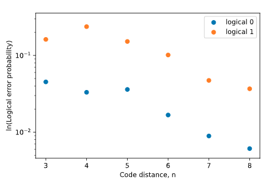

在其中我们可以获得的另一个见解是利用这些结果来确定某些误差过程发生的可能性有多大。

为了实现这一点，我们可以将校验图中的每条边代表一种特殊形式的误差，这种误差发生在回路中特定点的特定量子比特上。这就是导致相邻两个节点所对应校验子的值发生变化的唯一单个误差。因此利用这些结果来估计出现这种校验的概率，我们就可以估计出现这种误差事件的概率。具体来说，第一级是很明显：

$$\frac{p}{1 - p} \approx \frac{C_{11} }{C_{00} }$$

其中$p$误差概率所对应的特殊边。$C_{11}$是results\[n\]\[\'0\'\]中对应两个相邻节点的校验子值都为1的数量，$C_{00}$是都为0的数量。

解码器对象具有方法weight_syndrome_graph，该方法可用于确定这些比率，并为每个边分配权重$- ln(p/(1 - p))$。通过使用这一方法并检验权重，就可以轻易地检索出这些概率。

> if step_3:
>
> dec\[n_max\].weight_syndrome_graph(results=results\[n_max\])
>
> probs = \[\]
>
> for edge in dec\[n_max\].S.edges:
>
> ratio =
> np.exp(-dec\[n_max\].S.get_edge_data(edge\[0\],edge\[1\])\[\'distance\'\])
>
> probs.append( ratio/(1+ratio) )
>
> with open(\'results/probs\_\'+device_name+\'.txt\', \'w\') as file:
>
> file.write(str(probs))
>
> else:
>
> with open(\'results/probs\_\'+device_name+\'.txt\', \'r\') as file:
>
> probs = eval(file.read())

与其显示整个的列表，我们可以通过均值、标准差、最大/最小值和四分位数来获取该列表的摘要。

> import pandas as pd
>
> pd.Series(probs).describe().to_dict()
>
> 输出：
>
> {\'count\': 29.0,
>
> \'mean\': 0.18570187935383514,
>
> \'std\': 0.12966061187100625,
>
> \'min\': 0.014967523298503253,
>
> \'25%\': 0.05383187483426147,
>
> \'50%\': 0.1799797775530839,
>
> \'75%\': 0.2753350576063955,
>
> \'max\': 0.4345054945054945}

对真实量子设备进行基准测试不会产生完全相同的误差概率集。然而，读出错误和受控非门错误的概率可用作较好的比较。具体来说，我们可以使用后端对象从基准测试中获取这些值。

> if step_3:
>
> gate_probs = \[\]
>
> for j,qubit in enumerate(line):
>
> gate_probs.append( backend.properties().readout_error(qubit) )
>
> cx1,cx2 = 0,0
>
> if j\>0:
>
> gate_probs(
> backend.properties().gate_error(\'cx\',\[qubit,line\[j-1\]\]) )
>
> if j\<len(line)-1:
>
> gate_probs(
> backend.properties().gate_error(\'cx\',\[qubit,line\[j+1\]\]) )
>
> with open(\'results/gate_probs\_\'+device_name+\'.txt\', \'w\') as
> file:
>
> file.write(str(gate_probs))
>
> else:
>
> with open(\'results/gate_probs\_\'+device_name+\'.txt\', \'r\') as
> file:
>
> gate_probs = eval(file.read())
>
> pd.Series(gate_probs).describe().to_dict()
>
> 输出：
>
> {\'count\': 15.0,
>
> \'mean\': 0.08386929848831581,
>
> \'std\': 0.06860851140104485,
>
> \'min\': 0.02134613228239715,
>
> \'25%\': 0.050219500857068944,
>
> \'50%\': 0.05460651866864599,
>
> \'75%\': 0.09450000000000003,
>
> \'max\': 0.28}

5.2 测量误差缓解
----------------

> \#from qiskit import \*
>
> from qiskit import QuantumCircuit, QuantumRegister, Aer, execute

### 简介

噪声的影响是导致不太正确的输出。通常来说，在整个计算的过程中出现的噪声所产生的影响相当复杂，因为必须考虑每一个量子门对每个误差的影响。

其中一种简单的噪声形式出现在最终的测量中，此时回路所需进行的唯一工作就是提取一位字串作为输出。对于具有$n$量子比特的最终测量，则就需要提取$2^{n}$个可能的$n$位字串。将其想象成为这一过程中噪声的简单模型，测量首先会给输出中完美/无噪声的一类，然后噪声会导致这类完美的输出在返回给用户之前被随机干扰。

有了这样一个模型，就很容易准确地确定测量误差的影响是什么。我们可以简单地准备$2^{n}$种可能的基态并立即对其测量，看一看每种输出发生的概率。

例如，创建一个简单的噪声模型，该模型以概率$p$随机翻转输出中的每一比特。

> from qiskit.providers.aer.noise import NoiseModel
>
> from qiskit.providers.aer.noise.errors import pauli_error,
> depolarizing_error
>
> def get_noise(p):
>
> error_meas = pauli_error(\[(\'X\',p), (\'I\', 1 - p)\])
>
> noise_model = NoiseModel()
>
> noise_model.add_all_qubit_quantum_error(error_meas, \"measure\") \#
> measurement error is applied to measurements
>
> return noise_model

我们从每一个比特以1%的机率被翻转的实列开始。

noise_model = get_noise(0.01)

现在对其效果进行测试。具体过程为：定义一个包含两个量子比特的回路并设置其状态分别为$|00\rangle$、$|01\rangle$、$|10\rangle$和$|11\rangle$。在没有噪声的情况下将分别产生确定的输出"00"、"01"、"10"和"11"。现在看看有噪声时会发生什么。在这里以及本节的其余部分中，为每个回路采集的样本次数为shots=10000。

> for state in \[\'00\',\'01\',\'10\',\'11\'\]:
>
> qc = QuantumCircuit(2,2)
>
> if state\[0\]==\'1\':
>
> qc.x(1)
>
> if state\[1\]==\'1\':
>
> qc.x(0)
>
> qc.measure(qc.qregs\[0\],qc.cregs\[0\])
>
> print(state+\' becomes\',
>
> execute(qc,Aer.get_backend(\'qasm_simulator\'),noise_model=noise_model,shots=10000).result().get_counts())
>
> 输出：
>
> 00 becomes {\'10\': 109, \'01\': 100, \'00\': 9791}
>
> 01 becomes {\'10\': 2, \'01\': 9798, \'11\': 93, \'00\': 107}
>
> 10 becomes {\'10\': 9796, \'01\': 1, \'11\': 98, \'00\': 105}
>
> 11 becomes {\'10\': 82, \'01\': 96, \'11\': 9820, \'00\': 2}

从输出中可以看出正确的结果占绝大多数。只有一个量子比特有大约1%的几率发生翻转，例如在正确的输出是00或11的情况下是有大约1%的几率结果01、10。在10000个样本中，在两个量子比特上同时发生翻转只出现了很少的几次。

那么如果我们运行具有相同噪声德模型会发生什么样的结果呢？

{\'10\': 98, \'11\': 4884, \'01\': 111, \'00\': 4907}

上面的"01"和"10"占所有样本的1%左右。从对基态的分析中我们知道，当这些结果实际上永远不会发生时，这样的结果是可预计的，但当应与只有一个比特的不同结果相反时就会发生00或11。当我们看这两个结果的结果时，可以看出发生的概率大致相同。因此得出这样的结论：初始状态不仅仅是$|00\rangle$或$|11\rangle$，二十两者的均等叠加。如果是情况属实，表明结果应为：

{\'11\': 4977, \'00\': 5023}

以下是产生类似结果的量子回路（直至发生统计脉动）。

> qc = QuantumCircuit(2,2)
>
> qc.h(0)
>
> qc.cx(0,1)
>
> qc.measure(qc.qregs\[0\],qc.cregs\[0\])
>
> print(execute(qc,Aer.get_backend(\'qasm_simulator\'),noise_model=noise_model,shots=10000).result().get_counts())
>
> 输出：
>
> {\'10\': 82, \'01\': 98, \'11\': 4925, \'00\': 4895}

在这个例子中，我们首先查看了每个确定基态的结果，并使用这些结果来减轻误差对更一般状态形式的影响。这就是缓解测量误差的基本原则。

### 线性代数与误差缓解

现在我们只需要找到一种方法来执行缓解算法来代替手动运算。我们将会使用矩阵来描述随机过程，为此需要改写计数字典为列向量。比如，将字典{\'10\':
96, \'11\': 1, \'01\': 95, \'00\': 9808}改写为：

$$C = \begin{pmatrix}
9808 \\
95 \\
96 \\
1 \\
\end{pmatrix}$$

其中的第一个元素代表"00"的数量，下面的代表"01"的数量，以此类推。

从基态$|00\rangle$，$|01\rangle$，$|10\rangle$和$|11\rangle$获得信息被用于定义一个矩阵，该矩阵表示从一组理想的计数旋转为一组受到噪声影响的计数。这一过程仅是简单的使用字典中$|00\rangle$所对应的计数来完成，对其进行归一化（所有元素求和为1），然后将其用作矩阵的第一列。接下来一列的定义与值相同，由$|00\rangle$所对应的计数归一化后生成，以此类推。

**00** {\'10\': 96, \'11\': 1, \'01\': 95, \'00\': 9808}

**01** {\'10\': 2, \'11\': 103, \'01\': 9788, \'00\': 107 }

**10** {\'10\': 9814, \'11\': 90, \'01\': 1, \'00\': 95 }

**11** {\'10\': 87, \'11\': 9805, \'01\': 107, \'00\': 1 }

这就给出了一下矩阵。

$$M = \begin{pmatrix}
0.9808 & 0.0107 & 0.0095 & 0.0001 \\
0.0095 & 0.9788 & 0.0001 & 0.0107 \\
0.0096 & 0.0002 & 0.9814 & 0.0087 \\
0.0001 & 0.0103 & 0.0090 & 0.9805 \\
\end{pmatrix}$$

如果我们现在采用向量来描述一个给定状态的理想结果，那么当测量噪声存在时应用这一矩阵能够给出一个很好的近似结果。

$$C_{\text{noisy} } = MC_{\text{ideal} }$$

比如，将这一过程应用于态$(|00\rangle + |11\rangle)/\sqrt{2}$，

$$\begin{pmatrix}
0.9808 & 0.0107 & 0.0095 & 0.0001 \\
0.0095 & 0.9788 & 0.0001 & 0.0107 \\
0.0096 & 0.0002 & 0.9814 & 0.0087 \\
0.0001 & 0.0103 & 0.0090 & 0.9805 \\
\end{pmatrix}\begin{pmatrix}
0 \\
5000 \\
5000 \\
0 \\
\end{pmatrix} = \begin{pmatrix}
101 \\
4895.5 \\
4908 \\
96.5 \\
\end{pmatrix}$$

我们可以用以下代码表示这个过程。

> import numpy as np
>
> M = \[\[0.9808,0.0107,0.0095,0.0001\],
>
> \[0.0095,0.9788,0.0001,0.0107\],
>
> \[0.0096,0.0002,0.9814,0.0087\],
>
> \[0.0001,0.0103,0.0090,0.9805\]\]
>
> Cideal = \[\[0\],
>
> \[5000\],
>
> \[5000\],
>
> \[0\]\]
>
> Cnoisy = np.dot( M, Cideal)
>
> print(\'C_noisy =\\n\',Cnoisy)
>
> 输出：
>
> C_noisy =
>
> \[\[ 101. \]
>
> \[4894.5\]
>
> \[4908. \]
>
> \[ 96.5\]\]

无论以哪种方式测量，对$C_{\text{noisy} }$结果的计数发现，对态$(|00\rangle + |11\rangle)/\sqrt{2}$进行包含噪声的测量结果计数都非常接近于我们先前发现的实际数据。因此如果知道结果，那么这种矩阵方法确实是预测含有噪声结果的好方法。

但不幸的是，这与我们所需的完全相反。我们需要的不是将理想计数数据转换为噪声数据的方法，而是将噪声数据转换为理想数据的方法。在线性代数中，我么可以通过找出矩阵$M$的逆矩阵$M^{- 1}$来实现。

$$C_{\text{ideal} } = M^{- 1}C_{\text{noisy} }$$

> import scipy.linalg as la
>
> M = \[\[0.9808,0.0107,0.0095,0.0001\],
>
> \[0.0095,0.9788,0.0001,0.0107\],
>
> \[0.0096,0.0002,0.9814,0.0087\],
>
> \[0.0001,0.0103,0.0090,0.9805\]\]
>
> Minv = la.inv(M)
>
> print(Minv)
>
> 输出：
>
> \[\[ 1.01978044e+00 -1.11470783e-02 -9.87135367e-03 1.05228426e-04\]
>
> \[-9.89772783e-03 1.02188470e+00 9.39504466e-05 -1.11514471e-02\]
>
> \[-9.97422955e-03 -4.05845410e-06 1.01913199e+00 -9.04172099e-03\]
>
> \[ 9.15212840e-05 -1.07335657e-02 -9.35458279e-03 1.02008794e+00\]\]

将这个逆矩阵应用于$C_{\text{noisy} }$就能获得真实计数的计数。

> Cmitigated = np.dot( Minv, Cnoisy)
>
> print(\'C_mitigated =\\n\',Cmitigated)
>
> 输出：
>
> C_mitigated =
>
> \[\[-2.69429661e-15\]
>
> \[ 5.00000000e+03\]
>
> \[ 5.00000000e+03\]
>
> \[-1.44328993e-15\]\]

计数当然应该是整数，所以C_mitigated中的值都需取整，这就给出非常好的结果。

$$C_{\text{mitigated} } = \begin{pmatrix}
0 \\
5000 \\
5000 \\
0 \\
\end{pmatrix}$$

这正是所期望的结果，缓解的效果非常好!

### 在Qiskit中进行误差缓解

> from qiskit.ignis.mitigation.measurement import
> (complete_meas_cal,CompleteMeasFitter)

这一测量误差缓解的过程也可以使用Qiskit中的工具来完成。这一工具可以处理基态的数据收集，矩阵的构造和逆的计算。如上所述，可以使用伪逆来完成后者。但是，默认设置是使用最小二乘拟合这一更为精巧的方法。

例如，我们为一对量子比特做误差缓解。为此我们定义了一个双量子比特量子寄存器，并将其导入函数complete_meas_cal中。

> qr = qiskit.QuantumRegister(2)
>
> meas_calibs, state_labels = complete_meas_cal(qr=qr,
> circlabel=\'mcal\')

这一步骤生成了用于测量此对量子比特四个基态（$|00\rangle$，$|01\rangle$，$|10\rangle$和$|11\rangle$）的量子回路。

> for circuit in meas_calibs:
>
> print(\'Circuit\',circuit.name)
>
> print(circuit)
>
> print()
>
> 输出：

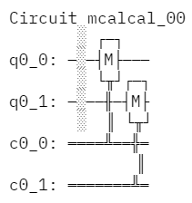

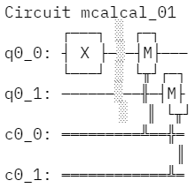

续：

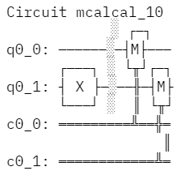

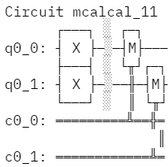

我们现在以无噪声的情况运行这些回路。

> \# Execute the calibration circuits without noise
>
> backend = qiskit.Aer.get_backend(\'qasm_simulator\')
>
> job = qiskit.execute(meas_calibs, backend=backend, shots=1000)
>
> cal_results = job.result()

通过这些结果，我们可以构造出标定矩阵$M$（calibration matrix）。

> meas_fitter = CompleteMeasFitter(cal_results, state_labels,
> circlabel=\'mcal\')
>
> print(meas_fitter.cal_matrix)
>
> 输出：
>
> \[\[1. 0. 0. 0.\]
>
> \[0. 1. 0. 0.\]
>
> \[0. 0. 1. 0.\]
>
> \[0. 0. 0. 1.\]\]

可以看到在没有噪声的情况下，该标定矩阵$M$即为单位矩阵（identity matrix）

现在来创建一个包含噪声的模型。为了让事情更有趣，我们设定误差比以前大十倍。

noise_model = get_noise(0.1)

再次运行上述回路，并打印出标定矩阵$M$。

> backend = qiskit.Aer.get_backend(\'qasm_simulator\')
>
> job = qiskit.execute(meas_calibs, backend=backend, shots=1000,
> noise_model=noise_model)
>
> cal_results = job.result()
>
> meas_fitter = CompleteMeasFitter(cal_results, state_labels,
> circlabel=\'mcal\')
>
> print(meas_fitter.cal_matrix)
>
> 输出：
>
> \[\[0.823 0.083 0.083 0.007\]
>
> \[0.089 0.819 0.01 0.099\]
>
> \[0.082 0.008 0.816 0.093\]
>
> \[0.006 0.09 0.091 0.801\]\]

这次找到了一个更有趣的矩阵，一个不可逆的矩阵。看看我们能对这一噪声缓解多少？再次使用Bell态$(|00\rangle + |11\rangle)/\sqrt{2}$进行测试。

> qc = QuantumCircuit(2,2)
>
> qc.h(0)
>
> qc.cx(0,1)
>
> qc.measure(qc.qregs\[0\],qc.cregs\[0\])
>
> results = qiskit.execute(qc, backend=backend, shots=10000,
> noise_model=noise_model).result()
>
> noisy_counts = results.get_counts()
>
> print(noisy_counts)
>
> 输出：
>
> {\'10\': 953, \'01\': 889, \'11\': 4109, \'00\': 4049}

在Qiskit中我们通过测量过滤器对象来缓解噪声。然后利用上面的结果来计算一组缓解的计数。Qiskit会将其输出为一个字典，因此用户不需要使用向量来获得结果。

> \# Get the filter object
>
> meas_filter = meas_fitter.filter
>
> \# Results with mitigation
>
> mitigated_results = meas_filter.apply(results)
>
> mitigated_counts = mitigated_results.get_counts(0)

为使结果更加清晰，我们把包含噪声以及缓解后的结果换出来。

> \#from qiskit.visualization import \*
>
> from qiskit.visualization import plot_histogram
>
> %config InlineBackend.figure_format = \'svg\' \# Makes the images look
> nice
>
> plot_histogram(\[noisy_counts, mitigated_counts\], legend=\[\'noisy\',
> \'mitigated\'\])
>
> 输出：

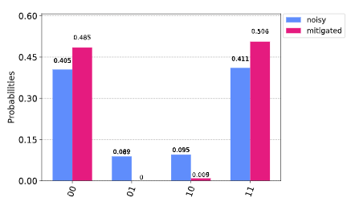

可以看到结果中近乎20%的样本处于错误的状态，图中将其转化为真实结果的精确表示。然而，这一示例仅包含两个量子比特以及一个简单的噪声模型。对于更多的量子比特和更复杂的噪音模型或来自真实设备的数据，缓解过程将面对更加严峻的挑战。也许您会找到比Qiskit中所使用的更好方法!

5.3 随机基准（Randomized Benchmarking）
---------------------------------------

### 内容

1\. 简介

2\. 随机基准协议

3\. 随机基准（RB）背后的直觉

4\. 同步随机基准

5\. 预测量子门保真度

6\. 参考文献

### 1. 简介

构建量子信息处理器的主要挑战之一是无法通过过程层析完全表征影响量子系统的噪声。此外，过程层析对旋转前后量子门的噪声以及测量噪声都很敏感。Gateset层析可以考虑这些误差，但缩放更糟。对噪声的完整描述能够用于确定出较好的校正方案，从而实现可靠地传输量子信息。

由于完整过程层析在大型系统中不可行，因此人们越来越关注可扩展的方法，以部分表征影响量子系统的噪声。在参考文献\[1\]中给出了一种可扩展鲁棒的算法（由$n$个量子比特组成的系统），该算法通过使用随机化技术的单参数对整个Clifford门进行基准测试。使用随机方法对量子门进行基准测试的概念通常称为**随机基准**（**RB：Randomized
Benchmarking**）。

### 2. 随机基准协议

首先导入相关的Qiskit中的类。

> \#Import general libraries (needed for functions)
>
> import numpy as np
>
> import matplotlib.pyplot as plt
>
> from IPython import display
>
> \#Import the RB Functions
>
> import qiskit.ignis.verification.randomized_benchmarking as rb
>
> \#Import Qiskit classes
>
> import qiskit
>
> from qiskit.providers.aer.noise import NoiseModel
>
> from qiskit.providers.aer.noise.errors.standard_errors import
> depolarizing_error, thermal_relaxation_error

随机基准协议由以下步骤组成（见参考文献\[1\]和\[2\]）:

#### 步骤1：生成随机基准序列

随机基准序列由从Clifford群中均匀选择的$\mathbf{n}$**-量子比特**上的随机Clifford元素组成，包括一个经计算的反转元素，其作用是将量子比特返回初始状态。

更准确地说，对于每一长度$m$，我们选出$K_{m}$个随机基准序列。每一个序列都包含$m$个随机元素$C_{i_{j} }$，其由从$\mathbf{n}$**-量子比特**的Clifford群中统一选出，然后第$m + 1$个元素被定义为：$C_{i_{m + 1} } = (C_{i_{1} }\text{...}C_{i_{m} })^{- 1}$，可通过Gottesmann-Knill定理有效地找出。

例如，我们生成以下几个双量子比特的Clifford回路序列。

> \#Generate RB circuits (2Q RB)
>
> ????????????????????（此处没有给出实例）
>
> \#number of qubits
>
> nQ=2
>
> rb_opts = {}
>
> \#Number of Cliffords in the sequence
>
> rb_opts\[\'length_vector\'\] = \[1, 10, 20, 50, 75, 100, 125, 150,
> 175, 200\]
>
> \#Number of seeds (random sequences)
>
> rb_opts\[\'nseeds\'\] = 5
>
> \#Default pattern
>
> rb_opts\[\'rb_pattern\'\] = \[\[0, 1\]\]
>
> rb_circs, xdata = rb.randomized_benchmarking_seq(\*\*rb_opts)

打印出对应于第一个RB序列的回路。

> rb_circs\[0\]\[0\].draw()
>
> 输出：

可以验证表示每个RB回路的幺正矩阵应是具有全局相位的单位矩阵。我们使用Aer中的幺正模拟器进行模拟。

> \# Create a new circuit without the measurement
>
> qregs = rb_circs\[0\]\[-1\].qregs
>
> cregs = rb_circs\[0\]\[-1\].cregs
>
> qc = qiskit.QuantumCircuit(\*qregs, \*cregs)
>
> for i in rb_circs\[0\]\[-1\]\[0:-nQ\]:
>
> qc.data.append(i)
>
> \# The Unitary is an identity (with a global phase)
>
> backend = qiskit.Aer.get_backend(\'unitary_simulator\')
>
> basis_gates = \[\'u1\',\'u2\',\'u3\',\'cx\'\] \# use U,CX for now
>
> job = qiskit.execute(qc, backend=backend, basis_gates=basis_gates)
>
> from qiskit_textbook.tools import array_to_latex
>
> array_to_latex(np.around(job.result().get_unitary(),3),
> pretext=\"\\\\text{Unitary} = \")

$$\text{Unitary} = \begin{bmatrix}
0.707\left( - 1 + i \right) & 0 & 0 & 0 \\
0 & 0.707\left( - 1 + i \right) & 0 & 0 \\
0 & 0 & 0.707\left( - 1 + i \right) & 0 \\
0 & 0 & 0 & 0.707\left( - 1 + i \right) \\
\end{bmatrix}$$

#### 步骤2：运行含有噪声的RB序列

我们可以使用Qiskit的Acer模拟器（含有噪声）或IBMQ中的provider来运行RB序列，并获取一列输出。

通过假定允许由$\Lambda_{i_{j},j}$代表的每一运算$C_{i_{j} }$都包含误差，则每个序列都可以通过运算建模：

$$\text{S}_{\text{i}_{\text{m} } } = ◯_{j = 1}^{m + 1}\left( \Lambda_{i_{j},j} \circ C_{i_{j} } \right)$$

其中$\text{i}_{\text{m} } = \left( i_{1},...,i_{m} \right)$和$i_{m + 1}$由$\text{i}_{\text{m} }$唯一确定。

> \# Run on a noisy simulator
>
> noise_model = NoiseModel()
>
> \# Depolarizing error on the gates u2, u3 and cx (assuming the u1 is
> virtual-Z gate and no error)
>
> p1Q = 0.002
>
> p2Q = 0.01
>
> noise_model.add_all_qubit_quantum_error(depolarizing_error(p1Q, 1),
> \'u2\')
>
> noise_model.add_all_qubit_quantum_error(depolarizing_error(2 \* p1Q,
> 1), \'u3\')
>
> noise_model.add_all_qubit_quantum_error(depolarizing_error(p2Q, 2),
> \'cx\')
>
> backend = qiskit.Aer.get_backend(\'qasm_simulator\')

#### 步骤3：获得残存几率的统计数据

对于每个序列$K_{m}$都测量其残存几率$Tr\lbrack E_{\psi}\text{S}_{\text{i}_{\text{m} } }(\rho_{\psi})\rbrack$。此处的$\rho_{\psi}$是考虑了制备误差的初始状态，$E_{\psi}$是考虑了测量误差的POVM元素。在无噪声的理想情况下$\rho_{\psi} = E_{\psi} = |\psi\rangle\langle\psi|$。

在实际情况中，可以测量返回精确初始状态的概率，即所有处于基态$|00...0\rangle$的量子比特，或者仅测量其中一个量子比特返回基态的概率。如果无法使用相关的测量方案，则独立测量量子比特会更方便。两种测量都将依据*旋转*（*twirl*）特性配合相同的衰减参数。

#### 步骤4：求平均序列保真度

对序列$K_{m}$随机实现的平均值求序列的平均保真度：

$$F_{\text{seq} }(m,|\psi\rangle) = Tr\lbrack E_{\psi}\text{S}_{K_{m} }(\rho_{\psi})\rbrack$$

其中

$$\text{S}_{K_{m} } = \frac{1}{K_{m} }\sum_{\text{i}_{\text{m} } }^{}\text{S}_{\text{i}_{\text{m} } }$$

为平均序列运算。

#### 步骤5：拟合结果

对不同的m值重复步骤1到4，拟合序列平均保真度的结果到模型：

$$\text{F}_{\text{seq} }^{\left( 0 \right)}(m,|\psi\rangle) = A_{0}\alpha^{m} + B_{0}$$

其中$A_{0}$和$B_{0}$用于吸收来自制备状态和测量的误差，以及最终量子门的边缘效应（edge
effect）。

$\alpha$用于确定平均误差率$r$，该误差率依据下式的关系也被称为**Error per
Clifford（EPC）**：

$$r = 1 - \alpha - \frac{1 - \alpha}{2^{n} } = \frac{2^{n} - 1}{2^{n} }\left( 1 - \alpha \right)$$

其中$n = nQ$是量子比特的数量。

例如，我们计算了每个RB序列的平均序列保真度，并将结果拟合到指数曲线上，以及计算处参数$\alpha$和**EPC**。

> \# Create the RB fitter
>
> backend = qiskit.Aer.get_backend(\'qasm_simulator\')
>
> basis_gates = \[\'u1\',\'u2\',\'u3\',\'cx\'\]
>
> shots = 200
>
> transpiled_circs_list = \[\]
>
> rb_fit = rb.RBFitter(None, xdata, rb_opts\[\'rb_pattern\'\])
>
> for rb_seed, rb_circ_seed in enumerate(rb_circs):
>
> print(\'Compiling seed %d\'%rb_seed)
>
> new_rb_circ_seed = qiskit.compiler.transpile(rb_circ_seed,
> basis_gates=basis_gates)
>
> transpiled_circs_list.append(new_rb_circ_seed)
>
> print(\'Simulating seed %d\'%rb_seed)
>
> job = qiskit.execute(new_rb_circ_seed, backend, shots=shots,
>
> noise_model=noise_model,
>
> backend_options={\'max_parallel_experiments\': 0})
>
> \# Add data to the fitter
>
> rb_fit.add_data(job.result())
>
> print(\'After seed %d, alpha: %f, EPC:
> %f\'%(rb_seed,rb_fit.fit\[0\]\[\'params\'\]\[1\],
> rb_fit.fit\[0\]\[\'epc\'\]))
>
> 输出：
>
> Compiling seed 0
>
> Simulating seed 0
>
> After seed 0, alpha: 0.981127, EPC: 0.014155
>
> Compiling seed 1
>
> Simulating seed 1
>
> After seed 1, alpha: 0.977603, EPC: 0.016798
>
> Compiling seed 2
>
> Simulating seed 2
>
> After seed 2, alpha: 0.980842, EPC: 0.014369
>
> Compiling seed 3
>
> Simulating seed 3
>
> After seed 3, alpha: 0.980397, EPC: 0.014702
>
> Compiling seed 4
>
> Simulating seed 4
>
> After seed 4, alpha: 0.980321, EPC: 0.014759

#### 附加步骤：画出结果

> plt.figure(figsize=(8, 6))
>
> ax = plt.subplot(1, 1, 1)
>
> \# Plot the essence by calling plot_rb_data
>
> rb_fit.plot_rb_data(0, ax=ax, add_label=True, show_plt=False)
>
> \# Add title and label
>
> ax.set_title(\'%d Qubit RB\'%(nQ), fontsize=18)
>
> plt.show()
>
> 输出：

### 3.RB背后的直觉

去极化的量子通道具备参数$\alpha$，类似于：量子比特有$\alpha$的概率保持其状态；有1-$\alpha$的概率状态变为完全混合态，即：

$$\rho_{f} = \alpha\rho_{i} + \frac{1 - \alpha}{2^{n} }*\mathbf{I}$$

假设我们有一个包含$m$个不一定都是Clifford门的量子门序列，其中各个量子门误差通道是具有参数$\alpha$的去极化通道（所有量子门的参数都是$\alpha$）。那么，在单个序列运行结束时元素状态有$\alpha^{m}$的概率正确，有$1 - \alpha^{m}$会变为完全混合态，因此：

$$\rho_{f}^{m} = \alpha^{m}\rho_{i} + \frac{1 - \alpha^{m} }{2^{n} }*\mathbf{I}$$

现在假设从基态开始；全部序列等同于单位矩阵；并在单个序列运行结束时以标准基矢测量其状态。我们得到在单个序列结束时的成功的概率为：

$$\alpha^{m} + \frac{1 - \alpha^{m} }{2^{n} } = \frac{2^{n} - 1}{2^{n} }\alpha^{m} + \frac{1}{2^{n} } = A_{0}\alpha^{m} + B_{0}$$

由此可见，成功的概率（即保真度）随着序列长度随指数$\alpha$呈指数衰减。

当通道不是去极化通道时，最后那个式子不一定正确。然而结果表明：如果量子门是均匀且随机的Clifford门，则每个量子门的噪声平均表现为去极化通道，并可由这些通道计算出一些参数，然后就获取了保真度的指数衰减。

正规的说法为：取一个量子通道$\overline{\Lambda}$的有限群$G$（如Clifford群）平均值也称为扭转（twirl）：

$$W_{G}(\overline{\Lambda})\frac{1}{|G|}\sum_{u \in G}^{}{U^{\dagger} \circ \overline{\Lambda} \circ U}$$

在整个幺正群上扭转会产生与Clifford群完全相同的结果。Clifford群是一个*2-design*的幺正群。

### 4. 同步随机基准

RB旨在通过两种方式解决多量子比特系统中的保真度。首先，可以通过构造$n -$量子比特Clifford群的序列来执行整个$n -$量子比特空间上的RB。此外，可以将$n -$量子比特空间细分为在每个子集中同时执行的量子比特$\{ n_{i}\}$和$n_{i} -$量子比特的RB\[4\]。两种方法都给出了$n -$量子比特空间中保真度的度量。

例如，通常在定义CNOT门的两个量子比特的子集上执行2Q
RB，而其他量子比特是静态的。如参考文献\[4\]中所述，此时的RB数据不一定会呈指数衰减，因为其他量子比特子空间不会发生扭转。子集通过同时RB进行更严格的特征化，由于所有量子比特均处于活动状态，因此它还可以测量一定程度的串扰误差。

并行RB（1Q RB和2Q RB）的示例：

https://github.com/Qiskit/qiskit-tutorials/blob/master/qiskit/ignis/randomized_benchmarking.ipynb

### 5. 预测量子门保真度

如果知道了底层量子门（量子门集）上的误差，我们就可以在不运行RB实验的情况下预测EPC。此计算可验证RB实验，随后的拟合会产生正确的EPC值。首先我们需要计算每个Clifford有多少个量子门。

然后，含有两个量子比特的Clifford门的误差函数calculate_2q_epc给出每个2Q
Clifford的误差。其假定底层量子门中的误差正在去极化。这一函数派生于\[5\]。

> \# count the number of single and 2Q gates in the 2Q Cliffords
>
> qubits = rb_opts\[\'rb_pattern\'\]\[0\]
>
> gate_per_cliff = rb.rb_utils.gates_per_clifford(
>
> transpiled_circuits_list=transpiled_circs_list,
>
> clifford_lengths=xdata\[0\],
>
> basis=basis_gates,
>
> qubits=qubits)
>
> for basis_gate in basis_gates:
>
> print(\"Number of %s gates per Clifford: %f\"%(
>
> basis_gate,
>
> np.mean(\[gate_per_cliff\[qubit\]\[basis_gate\] for qubit in
> qubits\])))
>
> 输出：
>
> Number of u1 gates per Clifford: 0.254694
>
> Number of u2 gates per Clifford: 1.282751
>
> Number of u3 gates per Clifford: 0.180022
>
> Number of cx gates per Clifford: 1.498253
>
> \# convert from depolarizing error to epg (1Q)
>
> epg_q0 = {\'u1\': 0, \'u2\': p1Q/2, \'u3\': 2 \* p1Q/2}
>
> epg_q1 = {\'u1\': 0, \'u2\': p1Q/2, \'u3\': 2 \* p1Q/2}
>
> \# convert from depolarizing error to epg (2Q)
>
> epg_q01 = 3/4 \* p2Q
>
> \# calculate the predicted epc from underlying gate errors
>
> pred_epc = rb.rb_utils.calculate_2q_epc(
>
> gate_per_cliff=gate_per_cliff,
>
> epg_2q=epg_q01,
>
> qubit_pair=qubits,
>
> list_epgs_1q=\[epg_q0, epg_q1\])
>
> print(\"Predicted 2Q Error per Clifford: %e (qasm simulator result:
> %e)\" % (pred_epc, rb_fit.fit\[0\]\[\'epc\'\]))
>
> 输出：
>
> Predicted 2Q Error per Clifford: 1.508622e-02 (qasm simulator result:
> 1.475925e-02)

另一方面，我们可以根据实验获得的EPC计算底层量子门（量子门集）上的误差。假设我们知道RB序列中每个单量子比特门的误差，就可以从两个量子比特RB实验的EPC预测2Q量子门误差。

双量子比特门误差函数calculate_2q_epg给出了每个2Q量子门的误差估计。在这一节中，我们使用非对称误差模型来制备单量子比特误差。在误差模型未知的情况下，可以用实用函数calculate_1q_epg单独进行1Q
RB实验来估计这些门的EPG值，如\[u1, u2, u3\]。

> \# use 2Q EPC from qasm simulator result and 1Q EPGs from depolarizing
> error model
>
> pred_epg = rb.rb_utils.calculate_2q_epg(
>
> gate_per_cliff=gate_per_cliff,
>
> epc_2q=rb_fit.fit\[0\]\[\'epc\'\],
>
> qubit_pair=qubits,
>
> list_epgs_1q=\[epg_q0, epg_q1\])
>
> print(\"Predicted 2Q Error per gate: %e (gate error model: %e)\" %
> (pred_epg, epg_q01))
>
> 输出：
>
> Predicted 2Q Error per gate: 7.261899e-03 (gate error model:
> 7.500000e-03)

### 6. 参考文献

1\. Easwar Magesan, J. M. Gambetta, and Joseph Emerson, Robust
randomized benchmarking of quantum processes,
https://arxiv.org/pdf/1009.3639

2\. Easwar Magesan, Jay M. Gambetta, and Joseph Emerson, Characterizing
Quantum Gates via Randomized Benchmarking,
https://arxiv.org/pdf/1109.6887

3\. A. D. C\'orcoles, Jay M. Gambetta, Jerry M. Chow, John A. Smolin,
Matthew Ware, J. D. Strand, B. L. T. Plourde, and M. Steffen, Process
verification of two-qubit quantum gates by randomized benchmarking,
https://arxiv.org/pdf/1210.7011

4\. Jay M. Gambetta, A. D. C´orcoles, S. T. Merkel, B. R. Johnson, John
A. Smolin, Jerry M. Chow, Colm A. Ryan, Chad Rigetti, S. Poletto, Thomas
A. Ohki, Mark B. Ketchen, and M. Steffen, Characterization of
addressability by simultaneous randomized benchmarking,
https://arxiv.org/pdf/1204.6308

5\. David C. McKay, Sarah Sheldon, John A. Smolin, Jerry M. Chow, and
Jay M. Gambetta, Three Qubit Randomized Benchmarking,
https://arxiv.org/pdf/1712.06550

5.4 测量量子体积
----------------

### 简介

量子体积（**Quantum Volume
QV**）是一个单数字度量标准，其依据具体协议在中等大小的近期量子计算机上测得。QV方法量化与量子计算机所能成功实现的宽度和深度相等的最大随机回路。具有高保真操作、高连接性、大型校准量子门组和回路重写工具链的量子计算系统有望具有更高的量子体积。

### 量子体积协议

量子体积协议（参考文献\[1\]）由以下步骤组成：

（为了证明需要导入相关Qiskit中的类。）

> %matplotlib inline
>
> %config InlineBackend.figure_format = \'svg\' \# Makes the images look
> nice
>
> import matplotlib.pyplot as plt
>
> \#Import Qiskit classes
>
> import qiskit
>
> from qiskit.providers.aer.noise import NoiseModel
>
> from qiskit.providers.aer.noise.errors.standard_errors import
> depolarizing_error, thermal_relaxation_error
>
> \#Import the qv function
>
> import qiskit.ignis.verification.quantum_volume as qv

#### 步骤1：生成QV序列

众所周知，量子算法可以表示为由双量子比特幺正量子门构建的多项式大小的量子回路。因此，模型回路由$d$层被表标记量子比特的随机排列以及是随机双量子比特门（自$\text{SU}(4)$）组成。当回路宽度$m$为奇数时，每一层中的一个量子比特不工作。

更加精确的表述为：一个具有**深度**$d$**宽度**$m$的**QV回路**是具有$d$层的序列$U = U^{(d)}\text{...}U^{(2)}U^{(1)}$：

$$U^{(t)} = U_{\pi_{t}(m^{'} - 1),\pi_{t}(m)}^{(t)} \otimes ... \otimes U_{\pi_{t}\left( 1 \right),\pi_{t}\left( 2 \right)}^{\left( t \right)}$$

每个都用时间t = 1 \...
d标记并作用于$m^{'} = 2\left\lfloor \frac{n}{2} \right\rfloor$个量子比特上。通过选择第$m$个量子比特所标记的均匀随机排列$\pi_{t} \in S_{m}$并从$\text{SU}(4)$上的哈尔测度（Haar
measure）中采样作用于量子比特$a$和$b$每一$U_{a,b}^{(t)}$来指定每一个层。

在下面的示例中有6个量子比特Q0，Q1，Q3，Q5，Q7，Q10。我们将研究完整的子集（每个回路电路的深度将等于子集中的量子比特的数量）。

> \# qubit_lists: list of list of qubit subsets to generate QV circuits
>
> qubit_lists = \[\[0,1,3\],\[0,1,3,5\],\[0,1,3,5,7\],\[0,1,3,5,7,10\]\]
>
> \# ntrials: Number of random circuits to create for each subset
>
> ntrials = 50

我们从一个小例子开始生成量子体积序列，因此运行时间不会太长。

qv_circs, qv_circs_nomeas = qv.qv_circuits(qubit_lists, ntrials)

例如，打印出与第一个QV序列相对应的回路。请注意，理想的回路在前n个量子比特上运行（其中n是子集中的量子比特的数量）。

> \#pass the first trial of the nomeas through the transpiler to
> illustrate the circuit
>
> qv_circs_nomeas\[0\] = qiskit.compiler.transpile(qv_circs_nomeas\[0\],
> basis_gates=\[\'u1\',\'u2\',\'u3\',\'cx\'\])

print(qv_circs_nomeas\[0\]\[0\])

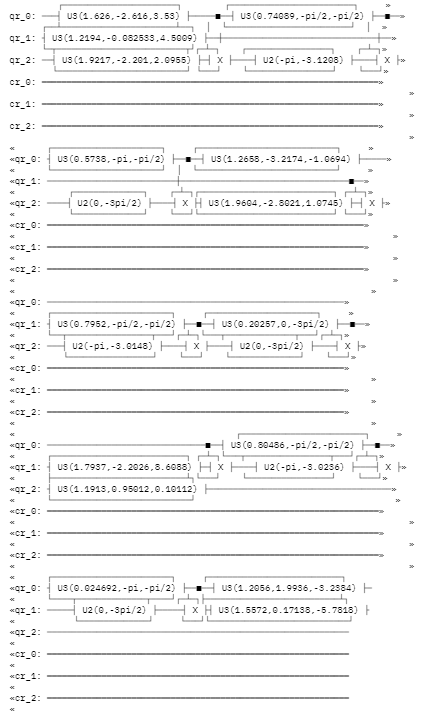

#### 步骤2：模拟理想的QV回路

量子体积方法要求我们知道每个回路的理想输出，因此我们使用Acer中的态向量模拟来获取理想结果。

> \#The Unitary is an identity (with a global phase)
>
> backend = qiskit.Aer.get_backend(\'statevector_simulator\')
>
> ideal_results = \[\]
>
> for trial in range(ntrials):
>
> print(\'Simulating trial %d\'%trial)
>
> ideal_results.append(qiskit.execute(qv_circs_nomeas\[trial\],
> backend=backend).result())。
>
> 输出：
>
> Simulating trial 0
>
> Simulating trial 1
>
> Simulating trial 2
>
> Simulating trial 3
>
> Simulating trial 4
>
> Simulating trial 5
>
> Simulating trial 6
>
> Simulating trial 7
>
> Simulating trial 8
>
> Simulating trial 9
>
> ...
>
> Simulating trial 39
>
> Simulating trial 40
>
> Simulating trial 41
>
> Simulating trial 42
>
> Simulating trial 43
>
> Simulating trial 44
>
> Simulating trial 45
>
> Simulating trial 46
>
> Simulating trial 47
>
> Simulating trial 48
>
> Simulating trial 49

下一步加载理想结果至量子体积拟合器中：

> qv_fitter = qv.QVFitter(qubit_lists=qubit_lists)
>
> qv_fitter.add_statevectors(ideal_results)

#### 步骤3：计算大输出

为了定义事实上成功实现了模型回路$U$，我们使用大输出（heavy
output）生成问题。理想输出的分布为$p_{U}(x) = |\left\langle x\left| U \right|0 \right\rangle|^{2}$，其中$x \in \{ 0,1\}^{m}$是一个可观测的位-字串（bit-string）。

鉴于输出概率集由升序排列$p_{0} \leq p_{1} \leq \cdots \leq p_{2^{m} - 1}$的区间$p_{U}\left( x \right)$给出。概率集的中位数为$p_{\text{med} } = (p_{2^{m - 1} } + p_{2^{m - 1} - 1})/2$，则大量输出为：

$$H_{U} = \{ x \in \left\{ 0,1\}^{m}\text{\ such\ that\ }p_{U}\left( x \right) > p_{\text{med} } \right\}$$

大输出（heavy
output）生成问题产生一组输出字串，使得三分之二以上的字串很巨大。

作为例证，我们将从各个深度和概率（对于试验0）打印大输出。

> for qubit_list in qubit_lists:
>
> l = len(qubit_list)
>
> print (\'qv_depth\_\'+str(l)+\'\_trial_0:\',
> qv_fitter.\_heavy_outputs\[\'qv_depth\_\'+str(l)+\'\_trial_0\'\])
>
> 输出：
>
> qv_depth_3\_trial_0: \[\'001\', \'010\', \'101\', \'110\'\]
>
> qv_depth_4\_trial_0: \[\'0000\', \'0001\', \'0010\', \'0011\',
> \'0111\', \'1010\', \'1101\', \'1110\'\]
>
> qv_depth_5\_trial_0: \[\'00000\', \'00011\', \'00101\', \'01000\',
> \'01001\', \'10000\', \'10001\', \'10010\', \'10011\', \'10100\',
> \'10101\', \'10110\', \'11001\', \'11011\', \'11100\', \'11101\'\]
>
> qv_depth_6\_trial_0: \[\'000000\', \'000100\', \'001000\', \'001001\',
> \'001011\', \'001100\', \'001111\', \'010000\', \'010010\',
> \'010100\', \'010101\', \'010111\', \'011000\', \'011001\',
> \'011010\', \'011011\', \'100000\', \'100001\', \'100010\',
> \'100100\', \'100101\', \'101100\', \'101101\', \'101111\',
> \'110001\', \'110011\', \'110101\', \'110110\', \'110111\',
> \'111001\', \'111011\', \'111100\'\]
>
> for qubit_list in qubit_lists:
>
> l = len(qubit_list)
>
> print (\'qv_depth\_\'+str(l)+\'\_trial_0:\',
> qv_fitter.\_heavy_output_prob_ideal\[\'qv_depth\_\'+str(l)+\'\_trial_0\'\])
>
> 输出：
>
> qv_depth_3\_trial_0: 0.8767167718108534
>
> qv_depth_4\_trial_0: 0.7579879384625499
>
> qv_depth_5\_trial_0: 0.7494374821348169
>
> qv_depth_6\_trial_0: 0.8363454481453244

#### 步骤4：定义噪声模型

我们为模拟器定义了一个噪声模型。为了模拟衰减，在CNOT和U门中加入去极化误差概率。

> noise_model = NoiseModel()
>
> p1Q = 0.002
>
> p2Q = 0.02
>
> noise_model.add_all_qubit_quantum_error(depolarizing_error(p1Q, 1),
> \'u2\')
>
> noise_model.add_all_qubit_quantum_error(depolarizing_error(2\*p1Q, 1),
> \'u3\')
>
> noise_model.add_all_qubit_quantum_error(depolarizing_error(p2Q, 2),
> \'cx\')
>
> \#noise_model = None

我们可以使用Qiskit中Aer模拟器(带有一些噪声模型)或使用IBMQ
provider执行QV序列并获取exp_results列表。

> backend = qiskit.Aer.get_backend(\'qasm_simulator\')
>
> basis_gates = \[\'u1\',\'u2\',\'u3\',\'cx\'\] \# use U,CX for now
>
> shots = 1024
>
> exp_results = \[\]
>
> for trial in range(ntrials):
>
> print(\'Running trial %d\'%trial)
>
> exp_results.append(qiskit.execute(qv_circs\[trial\],
> basis_gates=basis_gates, backend=backend, noise_model=noise_model,
> backend_options={\'max_parallel_experiments\': 0}).result())
>
> 输出：
>
> Running trial 0
>
> Running trial 1
>
> ...
>
> Running trial 48
>
> Running trial 49

#### 步骤5：计算平均量子门保真度

$m$-量子比特理想幺正$U$与所执行的$U^{'}$间的平均量子门保真度为：

$$F_{\text{avg} }\left( U,U^{'} \right) = \frac{|Tr(U^{\dagger}U^{'})|^{2}/2^{m} + 1}{2^{m} + 1}$$

对于模型回路$U$所实现的$U^{'}$观察到的分布为$q_{U}(x)$，采样大量输出的概率为：

$$h_{U} = \sum_{x \in H_{U} }^{}{q_{U}(x)}$$

对于trial 0，从回路的各个深度打印大量输出：

> qv_fitter.add_data(exp_results)
>
> for qubit_list in qubit_lists:
>
> l = len(qubit_list)
>
> \#print (qv_fitter.\_heavy_output_counts)
>
> print (\'qv_depth\_\'+str(l)+\'\_trial_0:\',
> qv_fitter.\_heavy_output_counts\[\'qv_depth\_\'+str(l)+\'\_trial_0\'\])
>
> 输出：
>
> qv_depth_3\_trial_0: 825
>
> qv_depth_4\_trial_0: 684
>
> qv_depth_5\_trial_0: 674
>
> qv_depth_6\_trial_0: 631

#### 步骤6：计算可达深度

一个随机选取深度$d$的模型回路的观测大输出的概率为：

$$h_{d} = \int_{U}^{}{h_{U}\text{dU} }$$

可达深度（achievable
depth）$d(m)$是其中最大的$d$，因此我们确信$h_{d} > 2/3$。意为：

$$h_{1},h_{2},\ldots,h_{d(m)} > 2/3\text{\ }\text{和}\text{\ }h_{d(m) + 1} \leq 2/3$$

现在，我们转换不同试验中的大输出，计算平均$h_{d}$和误差并绘制成图。

> plt.figure(figsize=(10, 6))
>
> ax = plt.gca()
>
> \# Plot the essence by calling plot_rb_data
>
> qv_fitter.plot_qv_data(ax=ax, show_plt=False)
>
> \# Add title and label
>
> ax.set_title(\'Quantum Volume for up to %d Qubits \\n and %d
> Trials\'%(len(qubit_lists\[-1\]), ntrials), fontsize=18)
>
> plt.show()
>
> 输出：

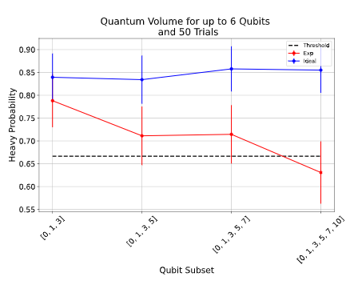

#### 步骤7：计算量子体积

量子体积将模型回路的宽度和深度视为同等重要，通常而言量子计算机可成功实现的最大正方形（$m = d$）模型回路的测量------量子体积$V_{Q}$：

$$\log_{2}V_{Q} = \arg{\max_{m}\min\left( m,d\left( m \right) \right)}$$

我们列出了每个深度的统计信息。对于所列出的每一个深度，我们都会列出深度是否有效以及置信区间为多少。深度是否有效的判断一句为其置信区间必须\>
97.5％。

> qv_success_list = qv_fitter.qv_success()
>
> qv_list = qv_fitter.ydata
>
> QV = 1
>
> for qidx, qubit_list in enumerate(qubit_lists):
>
> if qv_list\[0\]\[qidx\]\>2/3:
>
> if qv_success_list\[qidx\]\[0\]:
>
> print(\"Width/depth %d greater than 2/3 (%f) with confidence %f
> (successful). Quantum volume %d\"%
>
> (len(qubit_list),qv_list\[0\]\[qidx\],qv_success_list\[qidx\]\[1\],qv_fitter.quantum_volume()\[qidx\]))
>
> QV = qv_fitter.quantum_volume()\[qidx\]
>
> else:
>
> print(\"Width/depth %d greater than 2/3 (%f) with confidence %f
> (unsuccessful).\"%
>
> (len(qubit_list),qv_list\[0\]\[qidx\],qv_success_list\[qidx\]\[1\]))
>
> else:
>
> print(\"Width/depth %d less than 2/3
> (unsuccessful).\"%len(qubit_list))
>
> 输出：
>
> Width/depth 3 greater than 2/3 (0.788105) with confidence 0.982193
> (successful). Quantum volume 8
>
> Width/depth 4 greater than 2/3 (0.711211) with confidence 0.756474
> (unsuccessful).
>
> Width/depth 5 greater than 2/3 (0.714434) with confidence 0.772706
> (unsuccessful).
>
> Width/depth 6 less than 2/3 (unsuccessful).
>
> print (\"The Quantum Volume is:\", QV)
>
> 输出：
>
> The Quantum Volume is: 8

### 参考文献

\[1\] Andrew W. Cross, Lev S. Bishop, Sarah Sheldon, Paul D. Nation, and
Jay M. Gambetta, Validating quantum computers using randomized model
circuits, Phys. Rev. A 100, 032328 (2019).
https://arxiv.org/pdf/1811.12926